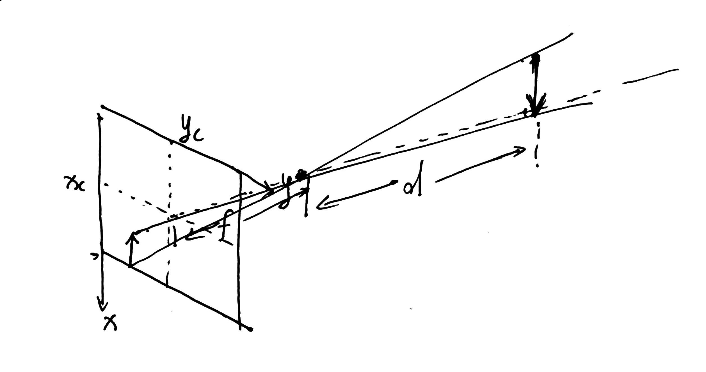

# 2021 年总结

## 从 SLAM 开始

SLAM 是 Simultaneous Localization and Mapping 的缩写，翻译过来是同时定位与重建，指搭载特定传感器的主体在没有先验环境知识的情况下，于运动过程中建立环境的模型，同时估计自己的运动。

在本项目中，环境是先验、已知的，甚至是不容许差错的；而视觉感知也仅限于“传感器信息读取”和“前端”。

### 传感器信息读取

本项目的主要传感器为相机。

#### RGB-D 相机

现阶段本项目采用 Orbbec Astra Pro 相机，相机本身质量不高，也暂时没找着拍照片的方法，应该**尽快拍出照片**

优点：可以同时获取到深度图像，以此可以方便地获取目标物的位置

缺点：对于塑料瓶等透明物品效果极差

### 视觉前端

视觉前端的任务是由相机获取的信息估算目标物体的位置和种类。

现阶段采用 GR-ConvNet 算法进行位置的选取，**不知道怎么做分类，两个模型可以一体可以分开**

### 机械后端

与 SLAM 不同，本项目不需要维护一个环境的长期信息；因此可以忽略 SLAM 的后端，而以机械结构的后端进行替代。

理论上讲，三位空间中六个自由度是完备的，为了简化问题，我们从平面坐标开始，平面坐标有两个参数，可以直接解析解

正运动学求解：

$$
x=l_1cos(\theta_1)+l_2cos(\theta_1+\theta_2)\\
y=l_1sin(\theta_1)+l_2sin(\theta_1+\theta_2)
$$

逆运动学求解：

$$
\left\{\begin{array}{l}
\theta_{1}=\alpha_{2}-\alpha_{1} \\
\theta_{2}=\arctan \left(\left(y-l_{1} \sin \theta_{1}\right) /\left(x-l_{1} \sin \theta_{1}\right)\right)-\theta_{1}
\end{array}\right.
$$

其中$\alpha_1$和$\alpha_2$的计算如下

$$
\left\{\begin{array}{l}
r^{2}=x^{2}+y^{2} \\
\cos \alpha_{3}=\left(l_{1}^{2}+l_{2}^{2}-r^{2}\right) / 2 l_{1} l_{2} \\
\sin \alpha_{3}=\sqrt{1-\cos ^{2} \alpha_{3}} \\
\sin \alpha_{1}=l_{2} \sin \alpha_{3} / r \\
\cos \alpha_{1}=\left(r^{2}+l_{1}^{2}+l_{2}^{2}\right) / 2 l_{1} r \\
\alpha_{2}=\arctan (y, x) \\
\alpha_{1}=\arctan \left(\sin \alpha_{1} / \cos \alpha_{1}\right)
\end{array}\right.
$$

路径规划/运动插补

对于直线轨迹规划，一般利用起点和终点的值以插补的形式计算出中间点的位置。假设机械臂末端需要从$p_1(x_1, y_1)$运动到$p_2(x_2, y_2)$，计算出两点之间的距离为

$$
L=\sqrt{(x_1-x_2)^2+(y_1-y_2)^2)}
$$

$p_1$到$p_2$的方向向量$p_{12}$为

$$
\mathbf{p_{12}} = p_2 - p_1
$$

该方向的单位矢量：

$$
\mathbf{n} = \frac{\sqrt{p_{12}}}{L}
$$

假设使用直线插补，插补时间间隔为$t_s$，则此段时间内 End Effector 的运行距离$d=vt_s$，共需要插补步数：

$$
N = \frac{L}{d+1}
$$

$$
\Delta x=(x_2-x_1)/N\\
\Delta y=(y_2-y_1)/N
$$

$$
x_{i+1}=x_1+i\Delta x\\
y_{i+1}=y_1+i\Delta y\\
$$

若采用直线插补，

#### 通信协议

#### 控制算法

---

[1]孙斌,常晓明,段晋军.基于四元数的机械臂平滑姿态规划与仿真[J].机械科学与技术,2015,34(01):56-59.DOI:10.13433/j.cnki.1003-8728.2015.0112.

VERP https://www.jianshu.com/p/eb3f38c0c5fa

1.Matlab 里的 simmechanics 工具箱。你建立机器人模型后，可以快速用 matlab 的物理引擎进行计算，通过程序可获取机器人运动状态。

2.Adams。它做动力学分析也很好用，并易于与 matlab 通信。

刚体动力学的李群表示 http://www.cs.cmu.edu/~junggon/tools/liegroupdynamics.pdf

https://www.coursera.org/learn/robotics1/home

https://www.youtube.com/watch?v=d4EgbgTm0Bg&t=951s

---

像素坐标指图像上一个点的像素坐标，单位为像素；图像坐标为位于成像平面的坐标系下该点坐标，是二维坐标系，单位为米；相机坐标系为以相机光心为原点、光轴为$z$轴，另外两轴分别与图像坐标系的$x$轴和$y$轴平行的三维坐标系，单位为米；世界坐标系是原点在任意位置的三维空间中的坐标系。

相机的成像过程如下：假设被成像的一点的世界坐标为$P_w = (x_w, y_w, z_w)$，其相机坐标$P_c = (x_c, y_c, z_c)$是其世界坐标根据相机当前位姿变换到相机坐标系下的结果。相机的位姿由其旋转矩阵$R$和平移向量$t$描述，即

$$
P_c = RP_w+t
$$

在从相机坐标系到图像坐标系的过程中，$z$方向的信息丢失了，$x$轴和$y$轴上产生了缩放。具体而言，设相机光心位于$c_x, c_y$被成像该点空间坐标$P_i = (x_i, y_i)$，根据相似三角形法则，有

$$
-\frac{x_i}{x_c} = -\frac{y_i}{y_c} = \frac{f}{d}
$$

负号的出现是因为，在小孔成像原理中，成的像是倒立的，相机经过光学或软件的处理后才让用户得到正立的像；但也可以等价地将目标平面和成像平面对称到光心的同侧，公式变为

$$
\frac{x_i}{x_c} = \frac{y_i}{y_c} = \frac{f}{d}
$$

像素坐标系的定义方式为：原点$o’$位于图像的左上角，$u$轴向下与$x$轴平行，$v$轴向右与$y$轴平行；像素坐标系与成像平面之间相差一个仿射变换，即

$$
\left\{\begin{aligned}
u &= \alpha x_i + c_x \\
v &= \beta y_i + c_y
\end{aligned}\right.
$$

将上述两式合并，得

$$
\left\{\begin{aligned}
u &= \frac{\alpha f}{d}x_c+ c_x \\
v &= \frac{\beta f}{d} y_c + c_y
\end{aligned}\right.
$$

将$\alpha f$合并为$f_x$，将$\beta f$合并为$f_y$，写成矩阵形式，为

$$
d\begin{pmatrix}u\\v\\1\end{pmatrix}
=
\begin{pmatrix}
f_x & 0 & c_x\\
0 & f_y & c_y \\
0 & 0 & 1
\end{pmatrix}
\begin{pmatrix}x_w \\ y_w \\ z_w\end{pmatrix}
=KP
$$

注意因为$z$维度丢失了，所以左侧用到齐次坐标，右侧是非齐次坐标

由此可以得到被成像点在图像上的位置。

获得了以上信息，可以逆向推导得到由像素坐标得到世界坐标的方法。需要注意的是，在一般的单目相机中，由相机坐标系到图像坐标系通常是不可逆的，因为有$z$方向上信息的丢失；但可以通过补偿手段，如采用双目相机、RGB-D 相机等进行深度估计，得到深度信息。

获取相机内外参的最常用方法为张正友标定法，但市面上销售的相机模组在出厂时就已经测试完毕并将内外参数写入设备 ROM 中，可以直接读取。

本项目中处理 RGB-D 相机丢失信息的方法是填充法

RGB-D 相机提供了多种数据流

| 流类型         | 描述                                                                                                                                             |
| -------------- | ------------------------------------------------------------------------------------------------------------------------------------------------ |
| ColorStream    | 来自传感器的 RGB 像素数据。每个 ColorFrame 中包含的数据组包含了每个像素的每个颜色组件的 0-255 范围内的值。当启动 InfraredStream 时，切勿启动它。 |
| DepthStream    | 来自传感器的深度数据。每个 DepthFrame 中包含的数据组包含了传感器视场内的每个像素的毫米值。                                                       |
| InfraredStream | 来自传感器的红外数据。当启动 ColorFrame 时，切勿启动它。                                                                                         |

**高层次**

| 流类型            | 描述                                                                                                                                                                                                                                                            |
| ----------------- | --------------------------------------------------------------------------------------------------------------------------------------------------------------------------------------------------------------------------------------------------------------- |
| PointStream       | 根据深度数据计算的世界坐标（XYZ）。每个 PointStream 中包含的每个点帧属于 Astra 数据组：Vector3f 元素可以更轻松地访问每个像素的 x、y 和 z 值。                                                                                                                   |
| HandStream        | 根据深度数据计算的手部节点。每一个 HandFrame 上，任何给定时间检测到的节点的数量可以通过 HandFrame::handpoint_count 函数来检索，并且可以通过 HandFrame::handpoints 函数来获取 astra::HandFrame::HandPointList。                                                  |
| BodyStream        | 根据深度数据计算得出的人体数据。它包含 19 个关节的二维位置和三维位置，以及深度数据和向下取整信息的用户掩码。它最多可支持 5 人。如果您要使用此数据流，则需要从 Orbbec 获取许可证代码。如果没有有效的许可证代码，您的应用程序只能在启动后 30 分钟内获取人体数据。 |
| MaskedColorStream | 根据色彩和人体数据进行计算。格式为 RGBA8888。它包含用户的色彩数据。我们可根据人体数据计算 ColorizedBodyStream。其格式为 RGB888。它使用不同的色彩来显示不同的用户。                                                                                              |

项目仍在开发之中，难度比想象中大，因此现阶段只有深度学习的代码。
