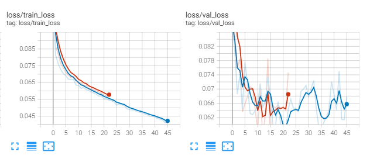

# `GR-ConvNet`论文研读

人工智能在工业上有着重要的作用

但相对于人来说，机械控制器的行为模式更加固定，面对复杂多变的物体

机械臂抓取位点的研究对工业控制、仓储物流都有重要的意义

现在对一种根据RGB-D数据快速、鲁棒地生成抓取位点的泛化的技术产生了极大的需求

最大的挑战是在有限的数据集上学到的方法应用于大规模的真实世界的数据

## 研究背景

系统分为两个模块主要模块，推理模块和控制模块。推理模块从场景中获取RGB图像与配准的深度信息，经过预处理输入神经网络。神经网络生成quality、angle、width三张图，从中预测抓取位姿

控制模块利用推理模块输出的位姿信息规划抓取任务

## 相关工作

## 研究内容

### 问题定义

定义这个问题有两种方法，一种较为直观：$(x, y, w, h, \theta)$，早期的研究主要基于这种表达；另一种分成两部分，一部分在机械臂一侧$G_{r}=\left(\mathbf{P}, \Theta_{r}, W_{r}, Q\right)$，$\mathbf{P}=(x, y, z)$是抓取工具尖端的中心位置，$\Theta_r$是工具绕$z$轴旋转的角度，$W_r$是工具需要达到的宽度，$Q \in [0, 1]$是抓取成功的概率打分。

另一部分在图像一侧：$G_{i}=\left(x, y, \Theta_{i}, W_{i}, Q\right)$，此处$(x, y)$指图像中坐标，$\Theta_i \in \left[\frac{-\pi}{2}, \frac{\pi}{2}\right]$代表在相机坐标系下的旋转角度，$W_i \in [0, W_{max}]$是在图像上的宽度，$Q$也是抓取成功的概率打分。

当我们在图像上观测到我们要抓取的物体，想要用机器人去执行抓取，我们将相机坐标系下的五元组$G_i$转化为世界坐标系下的四元组$G_r$
$$
G_r = T_{rc}\left(T_{ci}\left(G_i\right)\right)
$$
$T_{ci}$将使用相机内参将$G_i$图像从图像坐标系转换到相机所处的三维坐标系，也就是从二维到了三维；紧接着$T_{rc}$将其从相机坐标系转化到图像坐标系.

对于图像上多个抓取位点，我们可以取$Q$值较高的，堆叠成一组

$$
\mathbf{G}=(\mathbf{\Theta}, \mathbf{W}, \mathbf{Q}) \in \mathbb{R}^{3 \times h \times w}
$$

对齐：张正友棋盘格标定法

### 推理模块

将RGB和D合成，输入图像超过三个通道（会不会过拟合？）

输出三个feature map，

推理分成三个模块：

#### 特征提取

三个卷积层，五个残差层，三个？转置卷积层，生成四张`map`：`Quality`（每个点的抓取质量）、cos 2$\theta$、sin 2$\theta$，width，其中cos 2theta和sin 2theta被合并为`Angle`层

三层卷积、五层残差之后图像成了$56\times 56$，采用转置卷积进行上采样，得到和输入大小相同的图像表达。

#### 逐像素信息

#### 锚框生成

## 评价指标

设数据集中物体的集合为$D=\{D_1, \ldots D_n\}$，输入图像的集合$I=\{I^1, \ldots，I^n\}$，成功的抓取方式$G_{i}=\left\{g_{1}^{1} \ldots g_{m_{1}}^{1} \ldots g_{1}^{2} \ldots g_{m_{n}}^{n}\right\}
$，对模型进行端到端训练得到映射函数$\gamma(I, D) = G{i}$

最小化改性交叉熵

$$
-\frac{1}{n} \sum_{i=1}^{n} \frac{1}{m_{i}} \sum_{j=1}^{m_{i}} \log \gamma\left(g_{i}^{j} \mid I^{i}\right)
$$

使用Adam优化器、反向传播、mini-batch SGD，

损失函数如下：

$$
\mathscr{L}\left(G_{i}, \widehat{G}_{i}\right)=\frac{1}{n} \sum^{k} z_{k}
$$

$$
z_{k}=\left\{\begin{array}{lc}
0.5\left(G_{i_{k}}-\widehat{G_{i_{k}}}\right)^{2}, & \text { if }\left|G_{i_{k}}-\widehat{G_{i_{k}}}\right|<1 \\
\left|G_{i_{k}}-\widehat{G_{i_{k}}}\right|-0.5 & \text { otherwise }
\end{array}\right.
$$

## 总结展望

遇到的问题：

1. RGB-D摄像机对透明物体：根据文章x进行深度信息的填充
2. 由于模型采用$n$维度输入，不能直接采用预训练模型，分类任务的准确程度可能受到影响。

需要进行的工作：

1. 数据的收集与标注
2. 模型的改进（轻量：SqueezeNet；准确：Swin Transformer）

分拣：

1. 用两个网络
2. 魔改，使用预训练模型，残差输出输入到预测Grasp的网络
3. 能不能做成one-shot直接输出？可解释性差。

为什么不采用bounding box？因为是个黑盒？

训练过程：

（蓝色为作者提供，红色为本人训练）