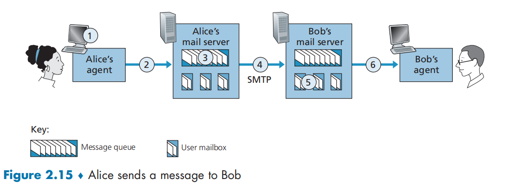

# Mailing protocols: STMP, POP3, and IMAP

互联网电子邮件系统由三部分组成：**user-agent** **mail-server** **Simple Mail Transfer Protocol**


## User-Agent

Agent就是代理人的意思，我代理你完成一项工作，大家上网使用的浏览器在网页浏览的上下文中就是一种User-Agent。一些网页可以根据HTTP协议或者JavaScript中User-Agent确定用户的浏览器类型，这里是同样的道理。UA就可以理解为客户端，比如Outlook，Gmail，国内常用的163、QQ，川大校园邮箱等。

## Mail Server

Mail servers form the core of the e-mail infrastructure. 

邮件系统的每个参与者(recipient)都在一个**邮件服务器**上有一个**邮箱**（暂不考虑一个人几个邮箱账号）。**邮箱**会管理和维护用户的邮件。

当用户甲给用户乙编辑了一封邮件点击“发送”的时候，邮件从甲的User-Agent出发，通过网络到达甲的Mail Server，甲的邮件服务器将邮件发到乙的邮件服务器，放入邮箱里。当乙想查看自己的邮件时，首先经过验证（即登录），然后阅读邮件。如果甲的邮件因为一些原因到达了甲的服务器但是到不了乙的服务器，这封邮件会被存放在甲的邮件服务器的**消息队列**里，经过一定时间尝试重发。

SMTP是电子邮件最主要的应用层协议，其使用TCP协议簇，一种可靠的协议（你想你用UDP发，把邮件发丢一块算什么事）。SMTP协议由客户端和服务端组成，也类似于HTTP里的C/S模式。

## SMTP



SMTP的报文和HTTP也非常的像


```http
From: alice@crepes.fr
To: bob@hamburger.edu
Subject: Searching for the meaning of life.
```

**注意STMP只能传输ASCII，所以附件里的图片大多是Base64编码过的**

## 邮件获取协议

回到甲给乙发邮件的故事，当我们通过SMTP服务将报文发送到乙的邮件服务器上时，乙需要收邮件。收邮件当然是在自己的电脑或手机上。但有一个问题：如果乙的邮件服务器装在自己的电脑或手机上，一旦乙的服务器关了，那么谁的邮件也发不过来了，所以必须一直开机。所以有些互联网服务提供商提供邮件服务，比如163，用户的User-Agent使用SMTP或HTTP协议将邮件内容上传到服务器，由服务器通过SMTP协议发送到目的服务器。

而User-Agent和Mail Server的交流通过HTTP或IMAP（Internet Mail Access Protocol，RFC 3501）协议。之前还有POP3协议也可以从服务器获取邮件，但是POP3协议允许电子邮件客户端下载服务器上的邮件，但是在客户端的操作（如移动邮件、删除邮件、标记已读等），不会反馈到服务器上，也就是说，**POP3是无状态的**，比如通过客户端收取了邮箱中的3封邮件并移动到其他文件夹，邮箱服务器上的这些邮件是没有同时被移动的 。一般来说，服务器在客户端通过POP3协议接收邮件之后会将该邮件从服务器上删除，而现在我们再没遇到这种情况。

而IMAP提供webmail 与电子邮件客户端之间的双向通信，客户端的操作都会反馈到服务器上，对邮件进行的操作，服务器上的邮件也会做相应的动作。

总之，**IMAP** 整体上为用户带来更为便捷和可靠的体验。**POP3** 更易丢失邮件或多次下载相同的邮件
