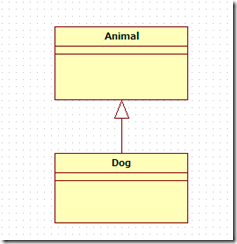
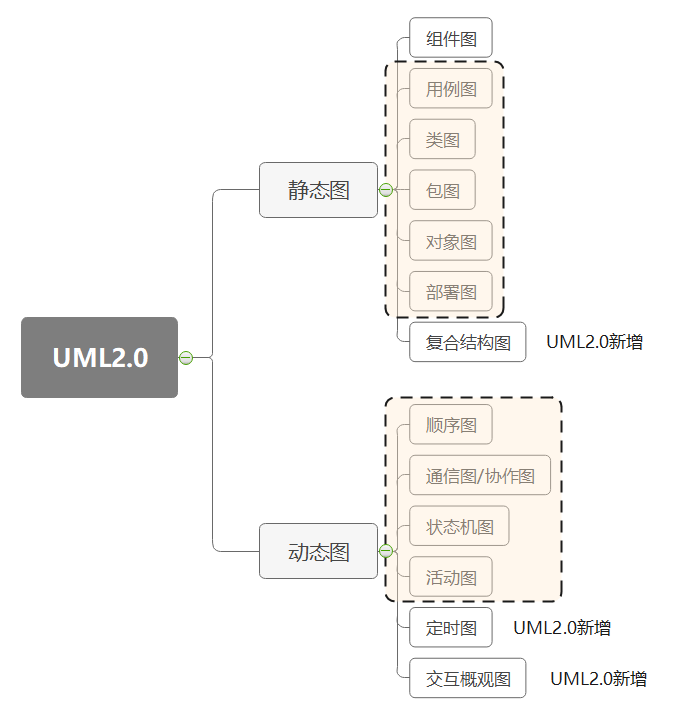

# 统一建模语言(Unified Modeling Language, UML)

- 是一种**面向对象设计**的建模工具

- 一个**支持模型化和软件系统开发**的**图形化语言**，为软件开发的所有阶段提供模型化和可视化支持

- 1997 年建立的一个 OMG (Object Management Group)标准

### UML 的目标

- 以**面向对象图**的方式来描述任何类型的系统
- 对具有**静态结构**和**动态行为**的系统建模

### UML 应用领域

- 软件系统的模型

## UML 建模

核心：**模型**

基本构件：**事务、关系、图**

### 事务

- 结构事务
- 行为事务
- 分组事务
- 注释事务

#### 七种结构事务

1. **类** 具有相同属性、方法、关系和语义的对象的集合。
2. **接口** 指类或组件提供特定服务的一组操作的集合。
3. **协作**定义了交互的操作，是一些角色和其他元素一起工作，提供一些合作的动作。
4. **用例**描述一系列的动作，系统执行这些动作将对一个特定参与者产生有价值且可观察的结果。
5. **活动类**的对象有一个或多个进程或线程。
6. **组件**物理上或可替换的系统部分，它实现了一个接口集合。
7. **节点**是一个物理元素，它在运行时存在，代表一个可计算的资源。

#### 两种结构事务

1. **交互（Interaction）**：包括一组元素之间的消息交换
1. **状态机（State Machine）**：由一些列对象的状态组成

#### 一种分组事务

1. **包（Package）**：UML 中*唯一*的组织机制

#### 一种注释事务

1. **注释（Note）**：用于解析说明 UML 元素

### 六种关系

1. 关联 (Association)：表示一种拥有的关系，具有方向性。
2. 聚合 (Aggregation)：表示整体-个体的关系。
3. 组合 (Composition)：表示整体与部分的关系，比聚合更加严格。
4. 泛化 (Generalization)：表示一个更泛化的元素与一个更具体元素之间的关系（继承）
5. 实现 (Realization)：表示类与接口的关系，类实现接口。
6. 依赖 (Dependency)：一个类的改动会影响另外一个类，则两个之间存在依赖关系。

#### 关联

- 表示一种拥有的关系，具有方向性。
- 表示类与类之间的联接，**它使一个类知道另一个类的属性和方法**，关系一般是长期性的，在程序中被关联类 B 以类属性的形式出现在关联类 A 中，也可能是关联类 A 引用了一个类型为被关联类 B 的全局变量。
- 表示方法：实线箭头，类 A 指向类 B

#### 聚合

聚合是关联关系的一种特例，是强的关联关系。

聚合是**整体和个体**之间的关系，即**has-a**的关系，整体与个体可以具有各自的生命周期，部分可以属于多个整体对象，也可以为多个整体对象共享。

表示方法：尾部为空心菱形的实线箭头（也可以没箭头），类 A 指向类 B

#### 组合

组合也是关联关系的一种特例。**组合是一种整体与部分的关系**，即 contains-a 的关系，比聚合更强。

**部分与整体的生命周期一致**，整体的生命周期结束也就意味着部分的生命周期结束，组合关系不能共享。

ü 表示方法：尾部为实心菱形的实现箭头（也可以没箭头），类 A 指向类 B

#### 泛化

•泛化是一种一般与特殊、一般与具体之间关系的描述，具体描述建立在一般描述的基础之上，并对其进行了扩展。

在程序中**通过继承类实现**。

表示方法：空心三角形箭头的实线，子类指向父类

#### 实现

实现是一种类与接口的关系，表示类是接口所有特征和行为的实现，在程序中一般通过类实现接口来描述

表示方法：空心三角形箭头的虚线，实现类指向接口

#### 依赖

概念：是一种使用的关系，即**一个类的实现需要另一个类的协助**，所以要尽量不使用双向的互相依赖，在程序中一般表现为类 A 中的方法需要类 B 的实例作为其参数或者变量，而类 A 本身并不需要引用类 B 的实例作为其成员变量。

表示方法：虚线箭头，类 A 指向类 B

| **图名称**                          | **解释**                                                       |
| ----------------------------------- | -------------------------------------------------------------- |
| **类图** **(Class diagrams)**       | 描述类、类的特性以及类之间的关系                               |
| 对象图 (Object diagrams)            | 描述一个时间点上系统各个对象的一个快照                         |
| 组件图 (Component diagrams)         | 描述组件的结构和连接                                           |
| 部署图 (Deployment diagrams)        | 描述在各个节点上的部署                                         |
| 活动图 (Activity diagrams)          | 描述过程行为与并行行为                                         |
| 状态图 (State diagrams)             | 描述事件如何改变对象的声明周期                                 |
| **用例图** **(User case diagrams)** | 描述用户与系统如何交互                                         |
| **时序图** **(Sequence diagrams)**  | 描述执行特定任务时对象之间的交互关系以及执行顺序               |
| 协作图 (Collaboration diagrams)     | 描述对象之间合作关系, 更侧重向用户对象说明那些对象有消息传递。 |
| 包图 (Package diagrams)             | 对构成系统的模型元素进行分组整理的图                           |
| 组合结构图 (Composite diagrams)     | 表示类或者构建内部结构的图                                     |
| 时间图 (Timing diagrams)            | 用来显示随时间变化，一个或多个元素的值或状态的更改             |
| 交互概览图 (Interation diagrams)    | 用活动图来表示多个交互之间的控制关系的图                       |

