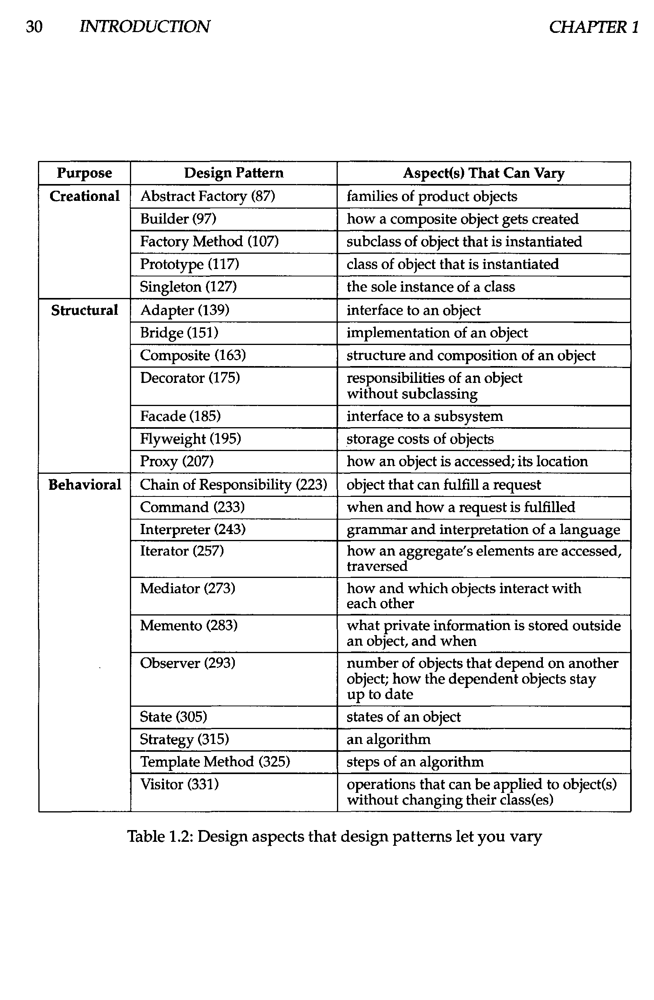
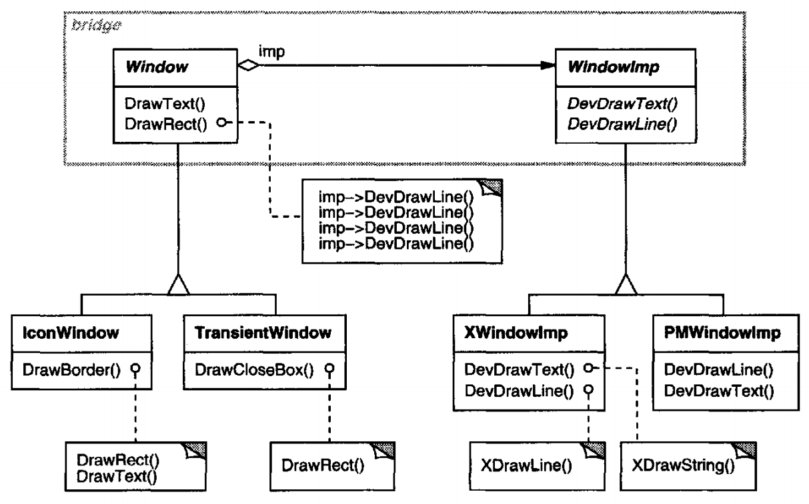
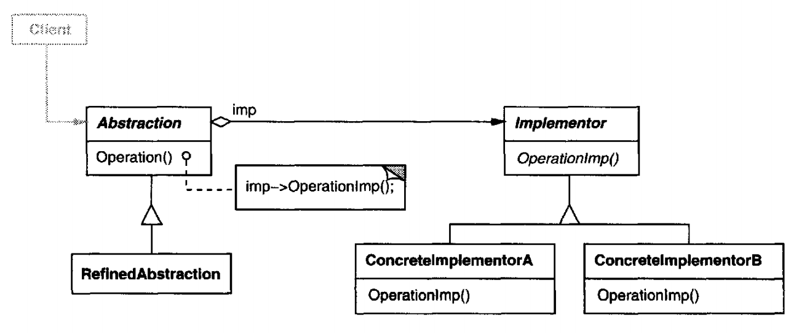
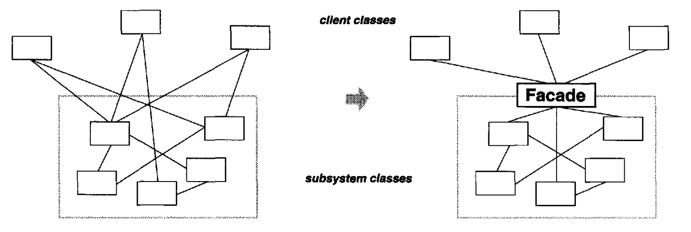
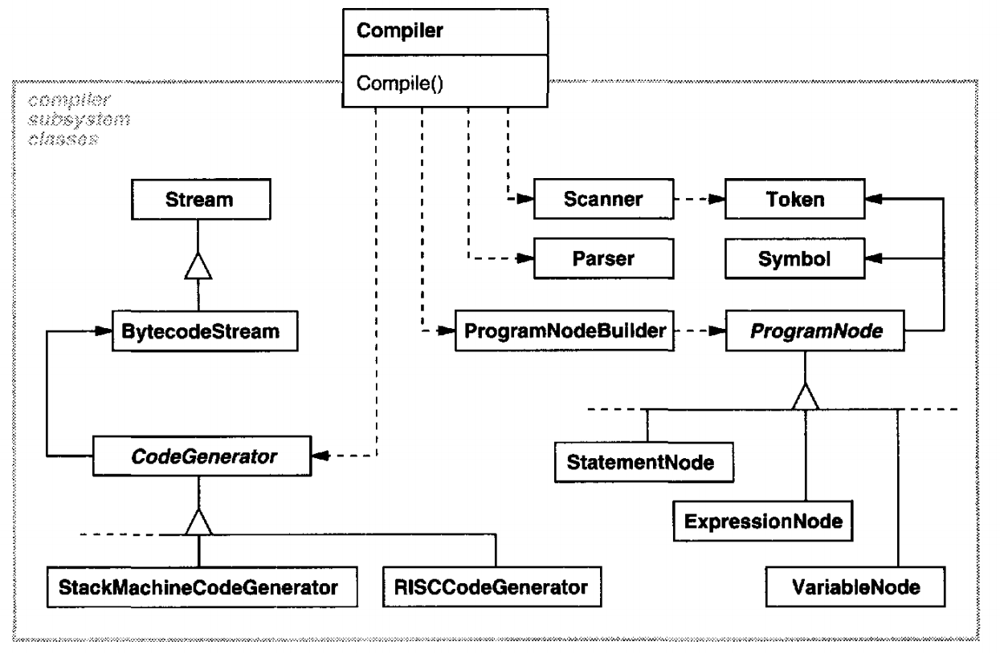
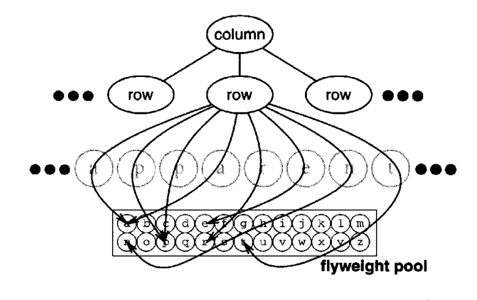
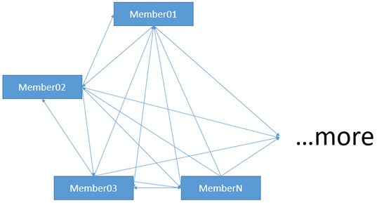
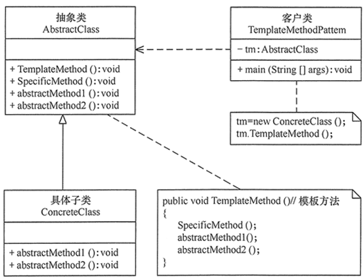

# 设计模式

> Designing object-oriented software is hard, and designing *reusable* object-oriented software is even harder.

In general, a pattern has four essential elements:
1. The **pattern name** is a handle we can use to describe a design problem, its solutions, and consequences in a word or two. Naming a pattern immediately
increases our design vocabulary. It lets us design at a higher level of abstraction.
Having a vocabulary for patterns lets us talk about them with our colleagues, in our documentation, and even to ourselves. It makes it easier to think about
designs and to communicate them and their trade-offs to others. Finding good
names has been one of the hardest parts of developing our catalog.
2. The **problem** describes when to apply the pattern .It explains the problem and its
context. It might describe specific design problems such as how to represent algorithms as objects.It might describe class or object structures that are symptomatic of an inflexible design. Sometimes the problem will include a list of conditions
that must be met before it makes sense to apply the pattern.
3. The **solution** describes the elements that make up the design, their relationships,
responsibilities, and collaborations. The solution doesn't describe a particular
concrete design or implementation, because a pattern is like a template that can be applied in many different situations. Instead, the pattern provides an abstract
description of a design problem and how a general arrangement of elements
(classes and objectsin our case) solves it.
4. The **consequences** are the results and trade-offs of applying the pattern. Though
consequences are often unvoiced when we describe design decisions, they are
critical for evaluating design alternatives and for understanding the costs and
benefits of applying the pattern.




## Creational Patterns 创建型设计模式

### 简单工厂模式

简单工厂模式不在GoF 23大设计模式之列，但有着广泛的应用。现在面向对象的程序中，对象越来越复杂， 但我们需要将对象的创建过程变得更简单，这就是简单工厂模式的理念。

```java
import java.util.ArrayList;

public class Main {
  public static void main(String[] args) {
    Student s = new Student();
    s.getCourse("Design Pattern");
    s.getCourse("Math");
    s.getCourse("Design Pattern");
    s.getCourse("NULL");
    s.learn();
  }
}

class Student {
  private ArrayList<Course> courses = new ArrayList<>();
  public void getCourse(String courseName) {
    try {
      Course selected = CourseFactory.getCourse(courseName);
      courses.add(selected);
    } catch (Exception e) {
      e.printStackTrace();
    }
  }
  public void learn() {
    for (var c : courses) {
      c.learn();
    }
  }
}

interface Course {
  public void learn();
}

class MathCourse implements Course {
  @Override
  public void learn() {
    System.out.println("Learning math");
  }
}

class DesignPatternCourse implements Course {
  @Override
  public void learn() {
    System.out.println("Design Pattern is GREAT!");
  }
}

class CourseFactory {
  public static Course getCourse(String courseName) throws NoSuchCourseException {
    if (courseName == "Math") {
      return new MathCourse();
    } else if (courseName == "Design Pattern") {
      return new DesignPatternCourse();
    } else {
      throw new NoSuchCourseException(courseName);
    }
  }
}

class NoSuchCourseException extends Exception {
  NoSuchCourseException(String msg) {
    super(msg);
  }
}
```

### Abstract Factory 抽象工厂模式

> Provide an interface for creating families of related or dependent objects without specifying their concrete classes.


抽象工厂用于由多个产品组成的产品族构建的系统的创建。系统应该与具体的产品独立，对于具体的产品，隐藏其实现而只暴露其接口。

假设你有两套UI，比方说一套Windows风格一套MAC风格，可以用一套生成窗口，生成滚动条，同样也可以用另一套生成窗口、生成滚动条，这就是抽象工厂模式。

优点：

1. 抽象工厂可保证客户端只使用同一个产品的产品族
2. 增强了程序的可扩展性，对于**新产品族**的加入，只需要实现一个新的具体工厂，不需要对现有代码修改

缺点：

1. 规定了所有可能被创建的产品的集合，增加**产品**需要对所有工厂代码进行修改，不符合开闭原则
2. 增加了系统的抽象性和理解难度

### Builder 建造者模式

> Separate the construction of a complex object from its representation so that the same construction process can create different representations.

#### 参与者

* Builder：抽象建造者
* Concrete Builder：具体建造者
* Director：指挥者
* Product：产品

```java
public class Main {
  public static void main(String[] args) {
    ComputerBuilder builder = new LaptopBuilder();
    Manufactor manufactor = new Manufactor();
    String newComputer = manufactor.buildComputer(builder);
    System.out.println(newComputer);
  }
}

interface ComputerBuilder {
  public void addScreen(String screen);
  public void addKeyboard(String keyboard);
  public String build();
}

class LaptopBuilder implements ComputerBuilder {
  private String screen = null;
  private String keyboard = null;
  @Override
  public void addScreen(String screen) {
    this.screen = screen;
  }
  @Override
  public void addKeyboard(String keyboard) {
    this.keyboard = keyboard;
  }
  @Override
  public String build() {
    return screen + ' ' + keyboard;
  }
}

class Manufactor {
  public String buildComputer(ComputerBuilder builder) {
    builder.addScreen("1024 x 768");
    builder.addKeyboard("QWERTY");
    return builder.build();
  }
}
```

### Factory Method 工厂方法模式

> Define an interface for creating an object, but let subclasses decide witch class to instantiate. Factory Method lets a class defer instantiation to subclasses.

在工厂方法模式中，将工厂继续拆分，工厂做专门的事情。

#### 角色

* 抽象工厂：所有工厂类的接口
* 具体工厂：负责创建具体对象
* 抽象产品：被程序依赖
* 具体产品：具体执行工作的产品


```java
public class Main {
  public static void main(String[] args) {
    IFactory factory = new FactoryA();
    IProduct product = factory.produce();
    product.doSomething();
  }
}

interface IFactory {
  public IProduct produce();
}

interface IProduct {
  public void doSomething();
}

class FactoryA implements IFactory {
  @Override
  public IProduct produce() {
    return new ProductA();
  }
}

class ProductA implements IProduct {
  @Override
  public void doSomething() {
    System.out.println("Product A produced");
  }
}
```

### Prototype 原型模式

> Specify the kinds of objects to create using a prototypical instance, and create new objects by copying this prototype.

简单地说，对于大型复杂的对象，可以创建一个对象并以之为原型，通过复制的方式获取大量该对象。

It hides the concrete product classes from the client, thereby reducing the number of names clients know about. Moreover, these patterns let a client work with application-specific classes without modification.

```java
public class Main {
  public static void main(String[] args) {
    ConcretePrototype prototype = new ConcretePrototype("original");

    ConcretePrototype clone = null;
    try {
      clone = prototype.clone();
    } catch (CloneNotSupportedException e) {
      e.printStackTrace();
    }

    clone.desc = "clone";
    System.out.println(prototype);
    System.out.println(clone);
  }

  static class ConcretePrototype implements Cloneable {
    private String desc;
    public ConcretePrototype(String desc) {
      this.desc = desc;
    }

    @Override
    protected ConcretePrototype clone() throws CloneNotSupportedException {
      return (ConcretePrototype) super.clone();
    }

    @Override
    public String toString() {
      return "ConcretePrototype{ " + desc + " }";
    }
  }
}
```

### Singleton 单例模式

> Ensure a class only has one instance, and provide a global point of access to it.

```java
public class Main {
  public static void main(String[] args) {
    Singleton s = Singleton.getSingleton();

    System.out.println(s);
    Singleton s2 = Singleton.getSingleton();
    System.out.println(s == s2);
  }
}

class Singleton {
  private static Singleton singleton = new Singleton();
  private Singleton() {}
  public static Singleton getSingleton() {
    return singleton;
  }
  @Override
  public String toString() {
    return super.toString();
  }
}
```

## Structural Patterns 结构型设计模式

### Adapter 适配器模式

> Convert the interface of a class into another interface clients except. Adapter lets classes work together that couldn't otherwise because of incompatible interfaces.


### Bridge 桥接模式

> Decouple an abstraction from its implementation so that the two can vary independently.

当一个设计有一种抽象和多种实现时，常见的方法是让实现继承抽象。但这样复用性差。桥接模式的基本思想是将**抽象和实现分离**，让两者可以相互独立地变化。



#### 角色

* 抽象Abstraction
* 修正抽象Refined Abstraction
* 实现Implementation
* 具体实现Concrete Implementation



### Composite 组合模式

> Compose objects into tree structures to represent part-whole hierarchies. Composite lets clients treat individual objects and compositions of objects uniformly

### Decorator 装饰器模式

> Attach additional responsibilities to an object dynamically. Decorators provide a flexible alternative to subclassing for extending functionality.

```java
public class Main {
  public static void main(String[] args) {
    Base base = new ConcreteBase();

    base = new ConcreteDecorator(base);
    base.operation();
  }
}

interface Base {
  void operation();
}

interface Decorator extends Base {}

class ConcreteBase implements Base {
  @Override
  public void operation() {
    System.out.println("Concrete base");
  }
}

class ConcreteDecorator implements Decorator {
  Base base;
  public ConcreteDecorator(Base base) {
    this.base = base;
  }
  @Override
  public void operation() {
    base.operation();
    System.out.println("And there's more");
  }
}
```


### Facade 门面模式

> Provide a unified interface to a set of interfaces in a subsystem. Facade defines a higher-level interface that makes the subsystem easier to use.

用户在调用系统暴露在外的一两个接口时，系统内调用了一系列的接口。

将系统内部的复杂接口用统一、简单的接口暴露给外部





#### 角色

* 门面Facade
* 子系统Subsystem


### Flyweight 享元模式

> Use sharing to support large numbers of fine-grained objects efficiently.

享元即通过共享对象池的机制的细粒度对象进行管理，以期提高系统效率。每个享元有外部状态和内部状态，可以被多个对象共享：被共享的享元的内部状态在享元内部维护，由其持有者分别维护其外部状态。

> 如果一个对象实例一经创建就不可变，那么反复创建相同的实例就没有必要，直接向调用方返回一个共享的实例就行，[^liaoxuefeng]



#### 角色

* 享元Flyweight：享元的接口
* 具体享元ConcreteFlyweight：共享享元
* 非共享具体享元：并非每个享元都是共享的
* 享元工厂FlyweightFactory
* 用户Client维护一个享元的引用并计算或存储享元的内部状态

```java
import java.io.FileInputStream;
import java.io.FileOutputStream;
import java.io.FileWriter;
import java.io.InputStream;
import java.io.InputStreamReader;
import java.io.OutputStream;
import java.io.Writer;
import java.util.HashMap;
import java.util.Map;

/**
 * 需求：手机网购App的界面，每一件商品都有描述图片，部分商品描述图片是相同的，再加载一遍会浪费大量时间和资源。
 * 同时因为没有本地缓存，每次打开应用需要重新加载，非常浪费资源。
 */
public class Main {
  public static void main(String[] args) {
    ImagePool imagePool = new ImagePool();
    Image image = imagePool.getImage("123456");
    System.out.println(image);
    image = imagePool.getImage("123456");
    image = imagePool.getImage("123456");
    image = imagePool.getImage("876543");
  }
}

class ImagePool {
  // 每张图片有三个状态：未加载、加载中、已加载
  // 目前先实现"未加载"和"已加载"两个功能。
  // "已加载"又分为"加载到本地存储"与"加载到内存"

  Map<String, Image> buffer = new HashMap<>();

  public Image getImage(String checksum) {
    Image result = null;
    result = getImageFromBuffer(checksum);
    if (result == null)
      result = getImageFromLocalStorage(checksum);
    if (result == null)
      result = getImageFromServer(checksum);
    return result;
  }

  private Image getImageFromServer(String checksum) {
    System.out.println("Got image from server");
    Image result =
        new Image(checksum, "Image{" + checksum + "}"); // Pretend to have everything on server
    storeInBuffer(checksum, result);
    storeLocally(checksum, result);
    return result;
  }

  private Image getImageFromLocalStorage(String checksum) {
    Image result = null;
    try (InputStream input = new FileInputStream("images/" + checksum)) {
      result = new Image(checksum, new String(input.readAllBytes()));
    } catch (Exception e) {
      result = null;
    }
    if (result != null) {
      System.out.println("Got image from local storage");
      storeInBuffer(checksum, result);
    }
    return result;
  }

  private Image getImageFromBuffer(String checksum) {
    Image result = null;
    result = buffer.get(checksum);
    if (result != null) {
      System.out.println("Got image from buffer");
    }
    return result;
  }

  private void storeInBuffer(String checksum, Image image) {
    buffer.put(checksum, image);
  }

  private void storeLocally(String checksum, Image image) {
    try (Writer output = new FileWriter("images/" + checksum)) {
      output.write(image.content);
    } catch (Exception e) {
      e.printStackTrace();
    }
  }
}

class Image {
  public String checksum;
  public String content;
  Image(String checksum, String content) {
    this.checksum = checksum;
    this.content = content;
  }

  @Override
  public String toString() {
    return content;
  }
}
```

### Proxy 代理模式

> Provide a surrogate or placeholder for another object to control access to it.

根据代理创建的时期，我们将代理分为静态代理和动态代理。

**静态代理**由程序员创建代理类，由程序员创建代理类或特定工具自动生成源代码再对其编译，在程序运行前代理类的 `.class` 文件就已经存在了。

```java
 //真实主题
class RealSubject implements ISubject {
    public void Request() {
        System.out.println("访问真实主题方法...");
    }
}

class Proxy implements ISubject {
    private RealSubject realSubject;
    public void Request() {
        if (realSubject == null) {
            realSubject = new RealSubject(); }
        preRequest();
        realSubject.Request();
        postRequest();
    }
    /* ... */
}
```

**动态代理在程序运行时，运用反射机制动态创建而成**

```java
import java.lang.reflect.*;

public class Main {
  public static void main(String[] args) {
    JDKAOP aop = new JDKAOP();
    ISubject subject = (ISubject) aop.getInstance(new RealSubject());
    subject.Request();
  }
}

class JDKAOP implements InvocationHandler {
  private Object target;

  public Object getInstance(Object target) {
    this.target = target;
    Class<?> clazz = target.getClass();
    return Proxy.newProxyInstance(clazz.getClassLoader(), clazz.getInterfaces(), this);
  }

  @Override
  public Object invoke(Object proxy, Method method, Object[] args) throws Throwable {
    before();
    Object o = method.invoke(this.target, args);
    after();
    return o;
  }

  private void before() {
    System.out.println("JDKAOP.before()");
  }

  private void after() {
    System.out.println("JDKAOP.after()");
  }
}

interface ISubject {
  public void Request();
}

//真实主题
class RealSubject implements ISubject {
  public void Request() {
    System.out.println("Real Subject");
  }
}
```

#### AOP(Aspect Oriented Programming，面向切面编程)

程序在运行时，动态的将代码切入到类的指定方法或者说指定位置上

在 AOP 中模块化单元是切面（Aspect）

将影响多个类的共同行为封装到一个可重用的模块中

切面抽象描述

在什么时候对哪些类的哪些行为执行进行拦截（切点），并使用封装好的可重用模块里面的行为（通知）对其拦截的业务行为进行功能增强

不需要修改业务模块的代码

AOP应用场景举例：

1. 系统的性能检测
2. 访问控制
3. 事务管理
4. 日志记录

优点：

业务代码简洁  例如：当需要在业务行为前后做一些事情时，只需要在该行为前后配置切面进行处理，无须修改当前业务行为代码

切面逻辑封装性好，可以被复用  例如：将日志逻辑封装为一个切面，可以在多个相关或者不相关的类的多个方法上配置该切面

## Behavioral Patterns 行为型设计模式

### Chain of Responsibility 责任链模式

> Avoid coupling the sender of a request to its receiver by giving more that one chance to handle the request. Chain the receiving objects and pass the request along the chain until an object handles it.

为了避免请求发送者与多个请求处理者耦合在一起，于是将所有请求的处理者通过**前一对象记住其下一个对象的引用而连成一条链**；当有请求发生时，可将请求沿着这条链传递，直到有对象处理它为止。

职责链模式存在以下两种情况。

**纯的职责链模式：**一个请求必须被某一个处理者对象所接收，且一个具体处理者对某个请求的处理只能采用以下两种行为之一：自己处理（承担责任）；把责任推给下家处理。

```java
public class Main {
  public static void main(String[] args) {
    //组装责任链
    Handler handler1 = new ConcreteHandler1();
    Handler handler2 = new ConcreteHandler2();
    handler1.setNext(handler2);
    //提交请求
    handler1.handleRequest("two");
  }
}

//抽象处理者角色
abstract class Handler {
  private Handler next;
  public void setNext(Handler next) {
    this.next = next;
  }
  public Handler getNext() {
    return next;
  }
  //处理请求的方法
  public abstract void handleRequest(String request);
}

//具体处理者角色1
class ConcreteHandler1 extends Handler {
  public void handleRequest(String request) {
    if (request.equals("one")) {
      System.out.println("具体处理者1负责处理该请求！");
    } else {
      if (getNext() != null) {
        getNext().handleRequest(request);
      } else {
        System.out.println("没有人处理该请求！");
      }
    }
  }
}

class ConcreteHandler2 extends Handler {
  public void handleRequest(String request) {
    if (request.equals("two")) {
      System.out.println("具体处理者2负责处理该请求！");
    } else {
      if (getNext() != null) {
        getNext().handleRequest(request);
      } else {
        System.out.println("没有人处理该请求！");
      }
    }
  }
}
```

**不纯的职责链模式：**允许出现某一个具体处理者对象在承担了请求的一部分责任后又将剩余的责任传给下家的情况，且一个请求可以最终不被任何接收端对象所接收。

```java
public class MemberService {
  public void login(String userName, String password) {
    Handler validateHandler = new ValidateHandler();
    Handler loginHandler = new LoginHandler();
    Handler authHandler = new AuthHandler();
    validateHandler.next(loginHandler);
    loginHandler.next(authHandler);
    validateHandler.doHandler(new Member(userName, password));
  }
}

public abstract class Handler {
  protected Handler chain;
  public void next(Handler handler) {
    this.chain = handler;
  }
  public abstract void doHandler(Member member);
}

public class LoginHandler extends Handler {
  public void doHandler(Member member) {
    System.out.println("登录成功！");
    member.setRoleName("管理员");
    chain.doHandler(member);
  }
}

public class AuthHandler extends Handler {
  public void doHandler(Member member) {
    if (!"管理员".equals(member.getRoleName())) {
      System.out.println("您不是管理员，没有操作权限");
      return;
    }
    System.out.println("您是管理员，允许操作");
  }
}

public class ValidateHandler extends Handler {
  public void doHandler(Member member) {
    if (StringUtils.isEmpty(member.getUsername()) || StringUtils.isEmpty(member.getPassword())) {
      System.out.println("用户名和密码为空");
      return;
    }
    System.out.println("用户名和密码不为空");
    System.out.println("用户名：" + member.getUsername() + ",密码：" + member.getPassword());
    chain.doHandler(member);
  }
}
```

n 优点

•降低了对象之间的耦合度。该模式使得一个对象无须知道到底是哪一个对象处理其请求以及链的结构，发送者和接收者也无须拥有对方的明确信息。

•增强了系统的可扩展性。可以根据需要增加新的请求处理类，满足开闭原则。

•增强了给对象指派职责的灵活性。当工作流程发生变化，可以动态地改变链内的成员或者调动它们的次序，也可动态地新增或者删除责任。

•责任链简化了对象之间的连接。每个对象只需保持一个指向其后继者的引用，不需保持其他所有处理者的引用，这避免了使用众多的 if 或者 if···else 语句。

•责任分担。每个类只需要处理自己该处理的工作，不该处理的传递给下一个对象完成，明确各类的责任范围，符合类的单一职责原则。

n 缺点

•不能保证每个请求一定被处理。由于一个请求没有明确的接收者，所以不能保证它一定会被处理，该请求可能一直传到链的末端都得不到处理。

•对比较长的职责链，请求的处理可能涉及多个处理对象，系统性能将受到一定影响。

•职责链建立的合理性要靠客户端来保证，增加了客户端的复杂性，可能会由于职责链的错误设置而导致系统出错，如可能会造成循环调用。

### Command 命令模式

> Encapsulate a request as an object, thereby letting you parameterize clients with different requests, queue or log requests, and support undoable operations.

将**一个请求封装为一个对象**，使**发出请求的责任**和**执行请求的责任**分割开。这样**两者之间通过命令对象进行沟通**，这样方便将命令对象进行储存、传递、调用、增加与管理。

图形化界面中，按钮按下时的回调函数就说明了这一点

<div><button onclick="alert('Hello')">clickme!</button></div>

n 优点

•通过引入中间件（抽象接口）降低系统的耦合度。

•**扩展性良好**，增加或删除命令非常方便。采用命令模式增加与删除命令不会影响其他类，且**满足“开闭原则”**。

•可以实现宏命令。命令模式可以与组合模式结合，将多个命令装配成一个组合命令，即宏命令。

•**方便实现** **Undo** 和 **Redo** **操作**。命令模式可以与后面介绍的备忘录模式结合，实现命令的撤销与恢复。

•可以在现有命令的基础上，增加额外功能。比如日志记录，结合装饰器模式会更加灵活。

n 缺点

•可能产生大量具体的命令类。因为每一个具体操作都需要设计一个具体命令类，这会增加系统的复杂性。

•命令模式的结果其实就是接收方的执行结果，但是为了以命令的形式进行架构、解耦请求与实现，引入了额外类型结构（引入了请求方与抽象命令接口），增加了理解上的困难。不过这也是设计模式的通病，抽象必然会额外增加类的数量，代码抽离肯定比代码聚合更加难理解。

### Interpreter 解释器模式

> Given a language, define a representation for its grammar along with an interpreter that uses the representation to interpret sentences in the language.

想想SQL。

### Iterator 迭代器模式

> Provide a way to access the elements of a aggregate object sequentially without exposing its underlying representation.

这个最不用讲了。

### Mediator 中介者模式

> Define an object that encapsulates how a set of objects interact. Mediator promotes loose coupling by keeping objects from referring to each other explicitly, and it lets you vary their interaction independently.

•定义一个中介对象来封装一系列对象之间的交互，使原有对象之间的耦合松散，且可以独立地改变它们之间的交互。中介者模式又叫调停模式，它是迪米特法则的典型应用。




```java
import java.util.ArrayList;
import java.util.List;

public class Main {
  public static void main(String[] args) {
    Mediator md = new ConcreteMediator();
    Colleague c1, c2;
    c1 = new ConcreteColleague1();
    c2 = new ConcreteColleague2();
    md.register(c1);
    md.register(c2);
    c1.send();
    System.out.println("-------------");
    c2.send();
  }
}

//抽象中介者
abstract class Mediator {
  public abstract void register(Colleague colleague);
  public abstract void relay(Colleague cl); //转发
}

//具体中介者
class ConcreteMediator extends Mediator {
  private List<Colleague> colleagues = new ArrayList<Colleague>();
  public void register(Colleague colleague) {
    if (!colleagues.contains(colleague)) {
      colleagues.add(colleague);
      colleague.setMedium(this);
    }
  }
  public void relay(Colleague cl) {
    for (Colleague ob : colleagues) {
      if (!ob.equals(cl)) {
        ((Colleague) ob).receive();
      }
    }
  }
}

//抽象同事类
abstract class Colleague {
  protected Mediator mediator;
  public void setMedium(Mediator mediator) {
    this.mediator = mediator;
  }
  public abstract void receive();
  public abstract void send();
}

//具体同事类1
class ConcreteColleague1 extends Colleague {
  public void receive() {
    System.out.println("具体同事类1收到请求。");
  }
  public void send() {
    System.out.println("具体同事类1发出请求。");
    mediator.relay(this); //请中介者转发
  }
}

//具体同事类2
class ConcreteColleague2 extends Colleague {
  public void receive() {
    System.out.println("具体同事类2收到请求。");
  }
  public void send() {
    System.out.println("具体同事类2发出请求。");
    mediator.relay(this);
  }
}
```


### Memento 备忘录模式

> Without violation encapsulation, capture and externalize an object's internal state so that the object can be restored to this state later.

### Observer 观察者模式

> Define a one-to-many dependency between objects so that when one object changes state, all its dependents a notified and updated automatically.

### State 状态模式

> Allow an object to alter its behavior when its internal state changes. The object will appear to change its class.

#### 基本思想

对有状态的对象，把复杂的“判断逻辑”提取到不同的状态对象中，允许状态对象在其内部状态发生改变时改变其行为。

传统的解决方案是：将这些所有可能发生的情况全都考虑到，然后使用 if-else 或 switch-case 语句来做状态判断，再进行不同情况的处理。但是显然这种做法对复杂的状态判断存在天然弊端，条件判断语句会过于臃肿，可读性差，且不具备扩展性，维护难度也大。且增加新的状态时要添加新的 if-else 语句，这违背了“开闭原则”，不利于程序的扩展。

#### 应用场景

当一个对象的行为取决于它的状态，并且它必须在运行时根据状态改变它的行为时，就可以考虑使用状态模式。

一个操作中含有庞大的分支结构，并且这些分支决定于对象的状态时。


环境类（Context）角色：它定义了客户端需要的接口，内部维护一个当前状态，并负责具体状态的切换。

抽象状态（State）角色：定义一个接口，用以封装环境对象中的特定状态所对应的行为，可以有一个或多个行为。

具体状态（Concrete State）角色：实现抽象状态所对应的行为，并且在需要的情况下进行状态切换。

### Strategy 策略模式

> Define a family of algorithms, encapsulate each one, and make them interchangeable. Strategy lets the algorithm vary independently from clients that use it.

```java
public class Main {
  public static void main(String[] args) {
    Context c = new Context();
    Strategy s = new ConcreteStrategyA();
    c.setStrategy(s);
    c.strategyMethod();
    System.out.println("-----------------");
    s = new ConcreteStrategyB();
    c.setStrategy(s);
    c.strategyMethod();
  }
}

//抽象策略类
interface Strategy {
  public void strategyMethod(); //策略方法
}

//具体策略类A
class ConcreteStrategyA implements Strategy {
  public void strategyMethod() {
    System.out.println("具体策略A的策略方法被访问！");
  }
}
//具体策略类B
class ConcreteStrategyB implements Strategy {
  public void strategyMethod() {
    System.out.println("具体策略B的策略方法被访问！");
  }
}

//环境类
class Context {
  private Strategy strategy;
  public Strategy getStrategy() {
    return strategy;
  }
  public void setStrategy(Strategy strategy) {
    this.strategy = strategy;
  }
  public void strategyMethod() {
    strategy.strategyMethod();
  }
}

```

### Template Method 模板方法模式

> Define the skeleton of an algorithm in an operation, deferring some steps to subclasses. Template Method lets subclasses redefine certain steps of an algorithm without changing the algorithm's structure.




```java
public class Main {
  public static void main(String[] args) {
    AbstractClass tm = new ConcreteClass();
    tm.TemplateMethod();
  }
}

//抽象类
abstract class AbstractClass {
  //模板方法
  public void TemplateMethod() {
    SpecificMethod();
    abstractMethod1();
    abstractMethod2();
  }
  //具体方法
  public void SpecificMethod() {
    System.out.println("抽象类中的具体方法被调用...");
  }
  //抽象方法1
  public abstract void abstractMethod1();
  //抽象方法2
  public abstract void abstractMethod2();
}

//具体子类
class ConcreteClass extends AbstractClass {
  public void abstractMethod1() {
    System.out.println("抽象方法1的实现被调用...");
  }
  public void abstractMethod2() {
    System.out.println("抽象方法2的实现被调用...");
  }
}
```

优点

* 它封装了不变部分，扩展可变部分。它把认为是不变部分的算法封装到父类中实现，而把可变部分算法由子类继承实现，便于子类继续扩展。
* 它在父类中提取了公共的部分代码，便于代码复用。
* 部分方法是由子类实现的，因此子类可以通过扩展方式增加相应的功能，符合开闭原则。

缺点

* 对每个不同的实现都需要定义一个子类，这会导致类的个数增加，系统更加庞大，设计也更加抽象，间接地增加了系统实现的复杂度。
* 父类中的抽象方法由子类实现，子类执行的结果会影响父类的结果，这导致一种反向的控制结构，它提高了代码阅读的难度。
* 由于继承关系自身的缺点，如果父类添加新的抽象方法，则所有子类都要改一遍。

### Visitor 访问者模式

> Represent an operation to be preformed on elements of an object structure. Visitor lets you define a new operation without changing the classes of the elements on which it operates.

## 参考文献

[^liaoxuefeng]: 廖雪峰的Java教程 https://www.liaoxuefeng.com/wiki/1252599548343744/1281319417937953

Gamma, Erich, Helm, Richard, Author, and Johnson, Ralph, Author. *Design Patterns : Elements of Reusable Object-oriented Software*.