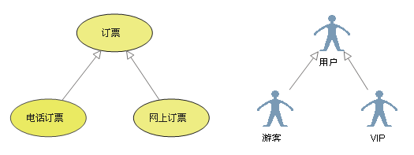
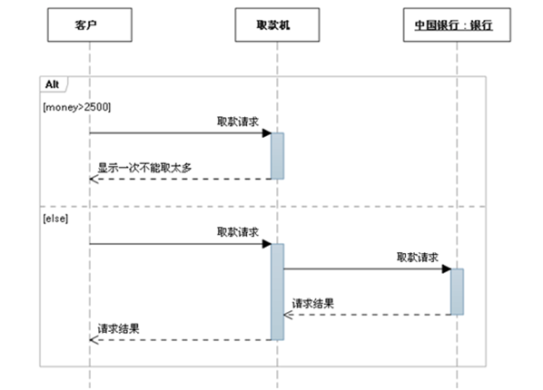

# 设计模式常用的 UML 图

[TOC]

## 用例图

用例图展现了一组**用例**、**参与者**和他们之间的**关系**。用例图从**用户角度**描述系统的静态使用情况，用于**建立需求模型**。

### 用例特征

保证用例能够正确地捕捉功能性需求，同时也是判断用例是否准确的依据。

1. 用例是动宾短语
2. 用例是相对独立的
3. 用例是由参与者启动的
4. 用例要有可观测的执行结果
5. 一个用例是一个单元

### 参与者

在 UML 用例图中，参与者是在系统外部与系统直接交互的人或事物。

参与者是**角色**而不是具体的人，它代表了参与者在与系统打交道的过程中所扮演的角色。在系统的实际运作中，一个实际用户可能对应系统的多个参与者。不同的用户也可以只对应于一个参与者，从而代表同一参与者的不同实例。参与者作为**外部用户**（而不是内部）与系统发生交互作用，是它的主要特征。在 UML 中，参与者使用如图所示的一个小人表示。

### 用例 Use Case

系统外部可见的一个系统功能单元。系统的功能由系统单元所提供，并通过一系列系统单元与一个或多个参与者之间交换的消息所表达。用椭圆表示，椭圆中的文字简述系统的功能。

### 关系 Relationship

常见关系类型有关联、泛化、包含和扩展。

#### 关联

•表示参与者与用例之间的通信，任何一方都可发送或接受消息。

•箭头指向：指向消息接收方

#### 子系统

•用来展示系统的一部分功能，这部分功能联系紧密。

#### 泛化

继承关系，子用例和父用例相似，但表现出更特别的行为；子用例将继承父用例的所有结构、行为和关系。子用例可以使用父用例的一段行为，也可以重载它。父用例通常是抽象。

箭头指向：指向父用例

## 类图

描述系统中的类，以及各个类之间的关系的**静态视图**。表示类、接口以及它们之间的写作关系，用于**系统设计阶段**。

```mermaid
classDiagram
	class Account {
		-balence: double = 1
		+Deposit(amount: double) int
		+ComputeInterest()* double
	}
```

从上到下分为三部分

- **类名**、**属性**和**操作**。
- 如果有属性，则每一个属性都必须有一个名字，另外还可以有其它的描述信息，如可见性、数据类型、缺省值等
- 如果有操作，则每一个操作也都有一个名字，其它可选的信息包括可见性、参数的名字、参数类型、参数缺省值和操作的返回值的类型等

### 类之间关系

<!-- prettier-ignore-start -->

| 关系 | 表示              |
| ---- | ----------------- |
| 继承 | 子类 `--|>` 父类  |
| 实现 | 实现 `..|>` 抽象  |
| 组合 | 部分 `--*` 整体   |
| 聚合 | 个体 `..*` 整体   |
| 关联 | 引用 `-->` 被引用 |
| 依赖 | 引用 `..>` 被依赖 |

<!-- prettier-ignore-end -->

## 时序图

时序图将交互关系表示为一个二维图，主要用于展示对象之间交互的顺序。

- **纵向**代表**时间轴**，时间沿竖线向下延伸。
- **横向**代表了在协作中各独立对象的**类元角色**。
- 类元角色用**生命线**表示。

当对象**存在**时，角色用一条**虚线**表示。当**对象的过程处于激活状态**时，生命线是一个**双道线**。消息用从一个对象的生命线到另一个对象生命线的箭头表示。箭头以时间顺序在图中从上到下排列。

```mermaid
sequenceDiagram
	participant 客户
	participant 取款机
	participant 银行
	客户 ->>+ 取款机: 取款请求
	alt money > 2500
		 取款机 -->> 客户: 显示一次不能取太多
	else
		取款机 ->>+ 银行: 取款请求
		银行 -->>- 取款机: 请求结果
		取款机 -->>- 客户: 请求结果
	end
```

元素：

- 生命线
- 同步消息
- 异步消息
- 注释
- 约束
- 组合片段
  - 抉择
  - 选项
  - 循环
