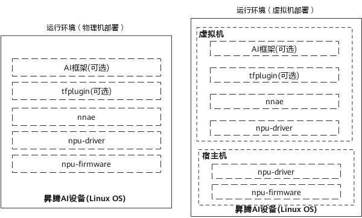
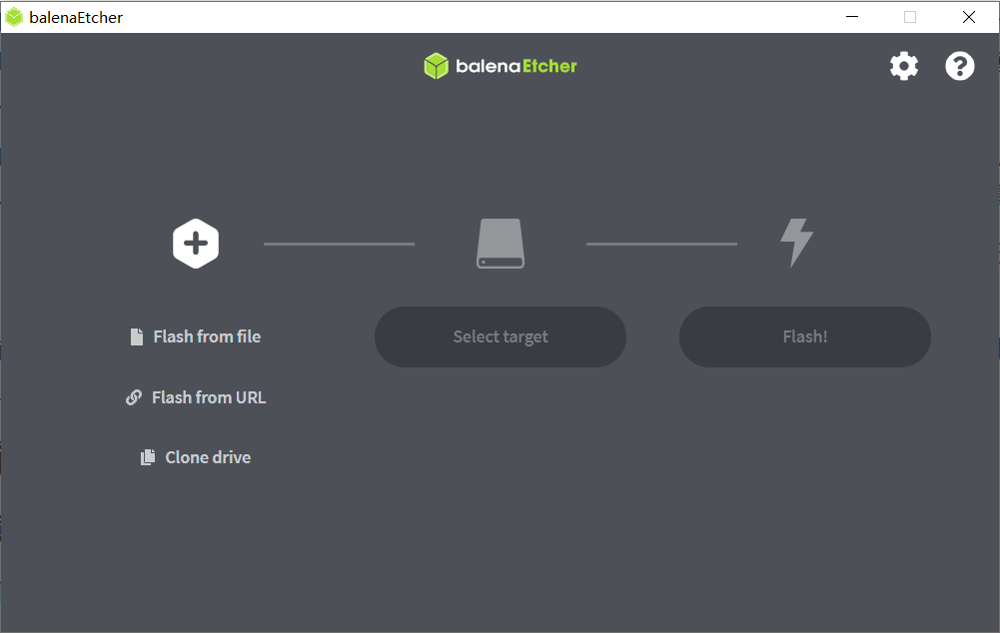
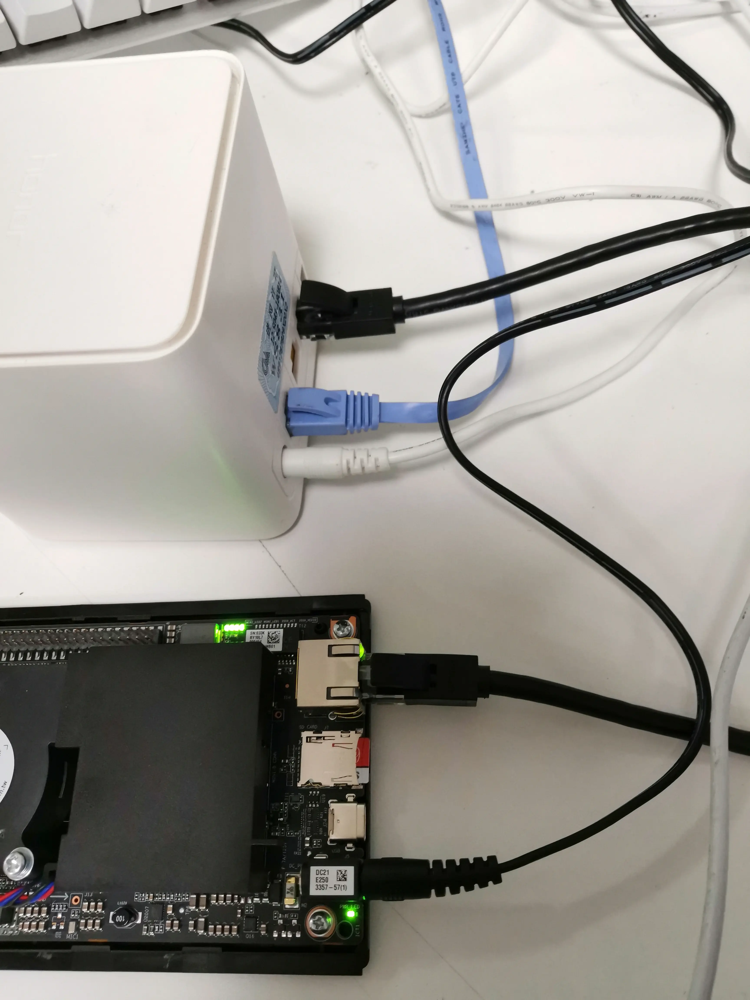
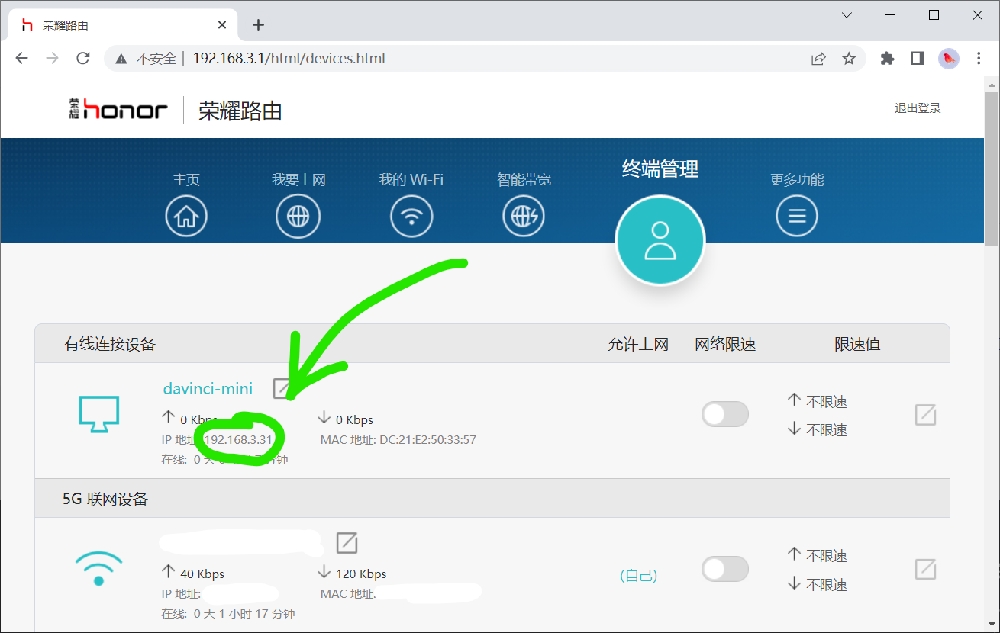
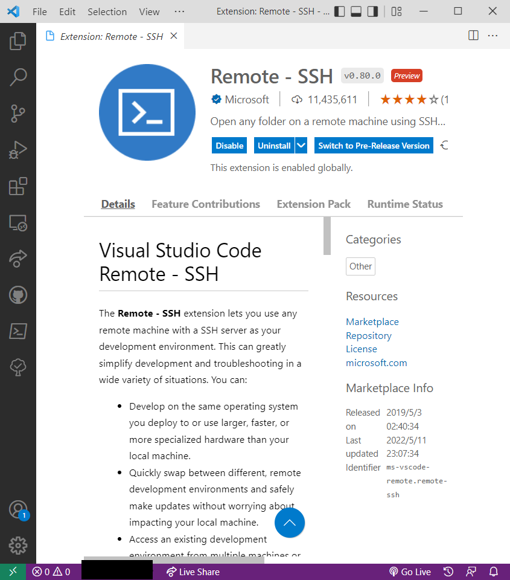
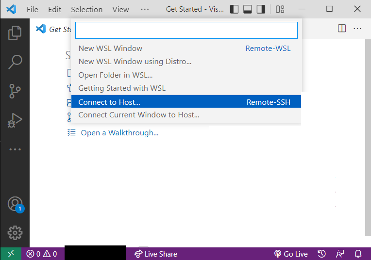
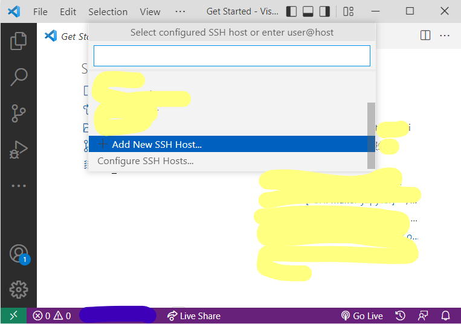
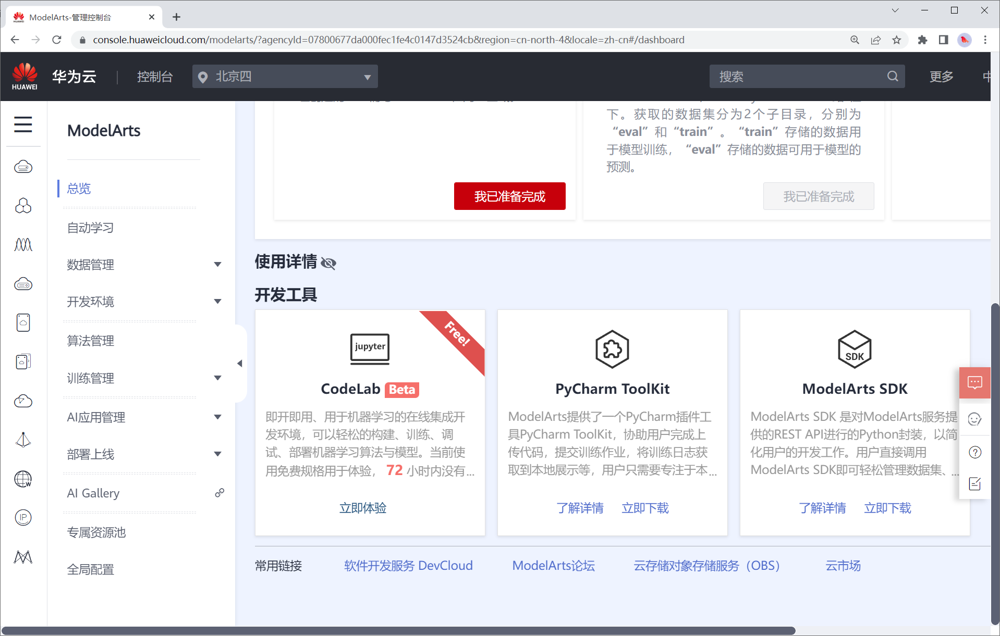

# Maker 五月昇腾技术讲座

本次讲座讲解华为 MindSpore 与 Atlas 200 DK 的使用

## 前置知识

### 必修

- `C++`：Linux 环境下的 C++ 语言开发、[CMake](https://cmake.org/) 工程

- `Python`：全部语法、第三方库管理

- 深度学习原理

- Linux 基本应用

### 选修

- [CUDA (Compute Unified Device Architecture)](https://developer.nvidia.com/cuda-toolkit) 编程
- 计算机网络（以调试网络问题）
- 嵌入式开发

## 工具软件

### 必选

- ==可以看到已连接用户 IP 地址的**路由器**==
- 镜像烧录工具：推荐[`balenaEther`](https://www.balena.io/etcher/)
- `ssh`终端：推荐[`MobaXTerm`](https://mobaxterm.mobatek.net/)
- 支持`ssh`远程开发的开发工具：本人使用[`VS Code`](https://code.visualstudio.com/)与[`CLion`](https://jetbrains.com/clion/)
- `C++`与`Python`的开发环境
- 本次实验使用镜像：[5.0.4alpha005-catenation-32G-20220111.img.zip](https://pan.baidu.com/s/1GCP45t9nklXTIU7NG087cw?pwd=kjm7)

### 可选

- 华为官方全流程开发工具链：[`MindStudio`](https://www.hiascend.com/software/mindstudio)

### 术语约定

- 主机：指开发使用的主机
- Host：运行逻辑代码的处理器
- Device：运行 AI 代码的处理器
- Tensor：张量，一个高维矩阵

## 实验流程

### 认识昇腾

#### 昇腾计算产业

参阅[昇腾计算产业概述](https://www.hiascend.com/zh/ecosystem/industry)

> 昇腾计算产业是基于昇腾系列（HUAWEI Ascend）处理器和基础软件构建的全栈 AI 计算基础设施、行业应用及服务，包括昇腾系列处理器、系列硬件、CANN（Compute Architecture for Neural Networks，异构计算架构）、AI 计算框架、应用使能、开发工具链、管理运维工具、行业应用及服务等全产业链。

#### 昇腾系列处理器

> 2018 年 10 月 10 日的 2018 华为全联接大会（HUAWEI CONNECT）上，华为轮值 CEO 徐直军公布了华为全栈全场景 AI 解决方案，并正式宣布了两款 AI 芯片：算力最强的昇腾 910 和最具能效的昇腾 310。https://mp.weixin.qq.com/s?__biz=MzA4MTE5OTQxOQ==&mid=2650027367&idx=3&sn=a295c720f68c3441825f804ffcb765d5&chksm=87983d33b0efb4251fa393af2092b734121c2191ba1aeab13723f601f4544b366bf88e385eca&mpshare=1&

参阅华为海思官网介绍：https://www.hisilicon.com/cn/products/Ascend

> 昇腾（HUAWEI Ascend) 310 是一款高能效、灵活可编程的人工智能处理器，在典型配置下可以输出 16TOPS@INT8, 8TOPS@FP16，功耗仅为 8W。采用自研华为达芬奇架构，集成丰富的计算单元，提高 AI 计算完备度和效率，进而扩展该芯片的适用性。全 AI 业务流程加速,大幅提高 AI 全系统的性能，有效降低部署成本。
>
> **昇腾 310**（HUAWEI Ascend)是一款华为专门为图像识别、视频处理、推理计算及机器学习等领域设计的高性能、低功耗 AI 芯片。芯片内置 2 个 AI core，可支持 128 位宽的 LPDDR4X，可实现最大 22TOPS（INT8） 的计算能力。
>
> 昇腾（HUAWEI Ascend) 910 是业界算力最强的 AI 处理器，基于自研华为达芬奇架构 3D Cube 技术，实现业界最佳 AI 性能与能效，架构灵活伸缩，支持云边端全栈全场景应用。算力方面，昇腾 910 完全达到设计规格，半精度（FP16）算力达到 320 TFLOPS，整数精度（INT8）算力达到 640 TOPS，功耗 310W。

#### 神经网络计算架构：CANN

##### 简介

https://www.hiascend.com/software/cann

AI 场景的异构计算架构，通过提供多层次的编程接口，支持用户快速构建基于昇腾平台的 AI 应用和业务。


CANN 的下载分为**社区版**和**商用版**，二者都是免费下载的。

- 社区版更新速度快，可以即时体验最新功能；
- 商用版更新速度慢，更加稳定

CANN 又分为`nnrt`和`nnae`两种发行版，其中`nnrt`只包含离线推理运行时，`nnae`包含离线推理、在线推理、训练的运行时。




##### 开发文档

https://support.huaweicloud.com/instg-cann51RC1alpha1/instg_000002.html

#### AI 计算框架：MindSpore

##### 简介

https://mindspore.cn/

> MindSpore 作为新一代深度学习框架，是源于全产业的最佳实践，最佳匹配昇腾处理器算力，支持终端、边缘、云全场景灵活部署，开创全新的 AI 编程范式，降低 AI 开发门槛。MindSpore 是一种全新的深度学习计算框架，旨在实现易开发、高效执行、全场景覆盖三大目标。为了实现易开发的目标，MindSpore 采用基于源码转换（Source Code Transformation，SCT）的自动微分（Automatic Differentiation，AD）机制，该机制可以用控制流表示复杂的组合。函数被转换成函数中间表达（Intermediate Representation，IR），中间表达构造出一个能够在不同设备上解析和执行的计算图。在执行前，计算图上应用了多种软硬件协同优化技术，以提升端、边、云等不同场景下的性能和效率。MindSpore 支持动态图，更易于检查运行模式。由于采用了基于源码转换的自动微分机制，所以动态图和静态图之间的模式切换非常简单。为了在大型数据集上有效训练大模型，通过高级手动配置策略，MindSpore 可以支持数据并行、模型并行和混合并行训练，具有很强的灵活性。此外，MindSpore 还有“自动并行”能力，它通过在庞大的策略空间中进行高效搜索来找到一种快速的并行策略。
>
> https://mindspore-website.obs.cn-north-4.myhuaweicloud.com/white_paper/MindSpore_white_paperV1.1.pdf

##### 开发文档

https://mindspore.cn/docs/zh-CN/r1.7/index.html

#### 开发工具链：MindStudio

#### 昇腾论坛

https://bbs.huaweicloud.com/forum/forum-726-1.html

#### Gitee Ascend/samples

#### 应用开发基本流程

##### 确定需求与问题

- 为什么有需求？
- 要解决什么问题？
- 为什么要用 AI？
- AI 能否解决问题？
- 有没有其他方案解决同样问题？
- 别人是如何处理这个问题的？

如果你的需求是区分红色还是黑色，请不要用 AI 解决

如果你的需求是区分三角形和正方形，请不要用 AI 解决

如果你的需求是计算 a + b，请不要用 AI 解决

##### 开发算法

- 理解问题
- 论文调研
- 实验验证

##### 模型训练

##### 模型部署

- 内存分配与回收
- 模型装载与卸载
- 设备能力的调用

##### 测试验收

### `Atlas`外观与接口

**Atlas 200 DK 开发者套件**（型号 3000）是以 Atlas 200 AI 加速模块（型号 3000）为 核心的开发者板形态的终端类产品。主要功能是将 Atlas 200 AI 加速模块（型号 3000）的接口对外开放，方便用户快速简捷的使用 Atlas 200 AI 加速模块（型号 3000），可以运用于平安城市、无人机、机器人、视频服务器等众多领域的预研开发。

**Atlas 200 AI 加速模块**（型号 3000）是一款高性能的 AI 智能计算模块，集成了昇腾 310 AI 处理器（Ascend 310 AI 处理器），可以实现图像、视频等多种数据分析与推理计 算，可广泛用于智能监控、机器人、无人机、视频服务器等场景。

目前市面上的`Atlas`有`IT21DMDA`（旧主板）和`IT21VDMB`（新主板）两个版本，`Maker`新到的一批都是新主板。新旧主板可以按照[Atlas 200 DK 技术白皮书](https://e.huawei.com/cn/material/server/2c6bd7fa84c3475690b587dc653f28f1)第 15 页的配图区分。以下以新主板为例讲解，请参阅[Atlas 200 DK 技术白皮书](https://e.huawei.com/cn/material/server/2c6bd7fa84c3475690b587dc653f28f1)。

### 首次启动

#### 镜像烧录

把刚刚的镜像拿下来，把 SD 卡插到电脑上，打开`balenaEther`，选文件为刚刚的`zip`压缩包（不必解压），选设备为你的`SD`卡，点击`Flash!`，整个过程需要大约半个小时完成。



#### 启动

打开`Atlas`上盖以观察 LED 状态灯，将烧录好的 SD 卡插入`Atlas 200 DK`读卡槽，接通电源，观察到主板上 LED 灯从网线口到 GPIO 针依次亮起，四灯全亮说明正常启动，如果十分钟之后还是没有四灯亮起，请参见本文[从失败中救赎](#从失败中救赎)


#### 连接网络

将`Atlas`与`Host`连接到同一局域网内，使得计算机可以通过网络访问`Atlas`。

在下图中，我将路由器接入公网，`Atlas`以有线方式接入，主机以无线方式接入。



访问路由器的管理界面（地址可以在路由器的说明书或底部找到），查看`davinci-mini`的`IP`地址。这里是`192.168.3.31`，每个局域网都不一样。为讲解方便，以下统一使用`192.168.3.31`代指`Atlas`的`IP`。



#### 首次登录

打开`ssh`终端程序，按照以下配置进行连接：

- 远程主机：上边看到的`ip`地址
- 用户名：`HwHiAiUser`
- 密码：`Mind@123`（默认密码）
- 端口：`22`（`ssh`协议默认。一般不需要配置）

如果是通过命令行会是这样

```bash
ssh HwHiAiUser@192.168.3.31
```


#### 软件升级

如果**按本教程的镜像烧录配置**的，无需手动配置，`apt`已配置为[华为云开源镜像站](https://mirrors.huaweicloud.com/)，`pip`已配置为[阿里巴巴开源镜像站](https://mirrors.aliyun.com/)。

使用以下命令更新软件包。如果不更新可能造成一些奇奇怪怪的错误。

```bash
sudo apt update && sudo apt upgrade -y
```

记住，密码是`Mind@123`。

#### 修改密码

如果这台设备所处的局域网会有**不受信任**的设备接入的话，请修改密码。相信聪明的你一定知道`Linux`下如何修改用户密码。

```bash
passwd
```

#### 放置`ssh`公钥

这一节合并到[`VS Code`远程登录](#`VS Code`远程登录)中了。

### 熟悉开发环境

这个镜像里是装好所有所需驱动的，但是为了防止意外，也为了后续开发方便，需要运行样例进行测试以保证安装正确。

巧妇难为无米之炊，我们先搞到一手代码。

#### Ascend/samples

昇腾官方维护的`Gitee`仓库中有大量的代码供学习与使用，我们通过这个机会来搭建开发环境。


#### `git clone`

可以直接`git clone`，也可以下载最新`release`包。

刚刚已经`ssh`到`Atlas`上了，继续用那个终端执行

```bash
HwHiAiUser@davinci-mini:~$ git clone https://gitee.com/Ascend/samples.git # 获取存储库
Cloning into 'samples'...
remote: Enumerating objects: 62315, done.
remote: Counting objects: 100% (144/144), done.
remote: Compressing objects: 100% (91/91), done.
remote: Total 62315 (delta 71), reused 79 (delta 48), pack-reused 62171
Receiving objects: 100% (62315/62315), 385.44 MiB | 6.53 MiB/s, done.
Resolving deltas: 100% (40512/40512), done.
Checking out files: 100% (3403/3403), done.
HwHiAiUser@davinci-mini:~$ ls # 看到多了一个 samples 文件夹
Ascend  hdc_ppc  hdcd  ide_daemon  samples  tdt_ppc  var  vf0
HwHiAiUser@davinci-mini:~$ cd samples/ # 进入并查看
HwHiAiUser@davinci-mini:~/samples$ ls
CONTRIBUTING_CN.md  CONTRIBUTING_EN.md  LICENSE  NOTICE  OWNERS  README.md  README_CN.md  build_run.sh  common  cplusplus  python  st
HwHiAiUser@davinci-mini:~/samples$ git checkout v0.6.0 # 切到 v0.6.0 tag
Note: checking out 'v0.6.0'.
HEAD is now at 1a8e9580 !1179 VPC通道任务深度可配 Merge pull request !1179 from wx/master
HwHiAiUser@davinci-mini:~/samples$ ls
CONTRIBUTING_CN.md  CONTRIBUTING_EN.md  LICENSE  NOTICE  OWNERS  README.md  README_CN.md  build_run.sh  common  cplusplus  python  st
```

#### `Vim`的使用

我们已经在远程开发了，刚刚在终端里敲的每一个字符都是基于`ssh`协议通过网线和路由器到开发板上的，并`piggy back`回来的。那让我们用`vim`写代码吧！

```bash
HwHiAiUser@davinci-mini:~/samples$ cd cplusplus/level2_simple_inference/2_object_detection/YOLOV3_coco_detection_picture/src/
HwHiAiUser@davinci-mini:~/samples/cplusplus/level2_simple_inference/2_object_detection/YOLOV3_coco_detection_picture/src$ vim main.cpp
```

~~不对吧，都 21 世纪 20 年代了，还有人用`vim`敲工程？~~

#### `VS Code`远程登录

忆苦思甜，刚才是忆苦，现在是思甜。

首先把[这个下载量一百多万的 Extension](https://marketplace.visualstudio.com/items?itemName=ms-vscode-remote.remote-ssh)装上。

或者点击这个链接直接调起 Code：<vscode:extension/ms-vscode-remote.remote-ssh>



然后点击屏幕右下角的`Open a remote window`，选择`Connect to Host`



接着选`Add New SSH Host`



接着输入刚刚我们已经输入过一次的命令

```bash
ssh -A HwHiAiUser@192.168.3.31
```

其中`-A`的作用是启用`Authentification Forwarding`。

然后选择写入哪个`ssh config`，不懂就直接回车。


点击`Connect`之后会打开一个新的`VS Code`窗口，`Code`会问你目标主机的系统（选**`Linux`**），用户的密码（如果你还没改的话是`Mind@123`）。

每次远程都要输入密码非常烦人，所以采用`ssh`。没什么好说的，在本机上打开`powershell`（`Linux`用户打开`bash`）

```bash
ssh-keygen
```

一路回车之后

```bash
cat ~/id_rsa.pub # 如果你生成的不是RSA密钥你应该比我明白所以我就不多写了你就自己看着来吧
```

把这里的内容，打开`~/.ssh/authorized_keys`，复制进去。

#### ModelArts

关于`MindSpore`我们并不打算在本地安装（否则我们今晚的时间全浪费在`conda install`和等待训练上了），所以我们直接租用`ModelArts`的`notebook`。

`ModelArts`提供了企业级环境。



不过我们的第一个任务是手写数字识别，在一般`CPU`上一分钟之内就可以完成训练，所以我们直接在本机运行，方便直观。

```bash
conda create -n ms python=3.9 mindspore-cpu=1.7.0 -c mindspore -c conda-forge -y
```

### 进阶应用开发

#### DVPP 与 AIPP

这两个更是企业级。

## `MindSpore` Internals

本节中我们将从源代码的角度对`MindSpore`进行解读。

> 对于工科学生，不到代码层面的理解都是粗浅的。

## 总结与展望

更多应用

- 序列
- 音频
- 点云

## 从失败中救赎

### 启动失败

四灯没有亮起说明启动失败，请尝试重新烧录镜像。

### 编译失败

### 运行应用失败
