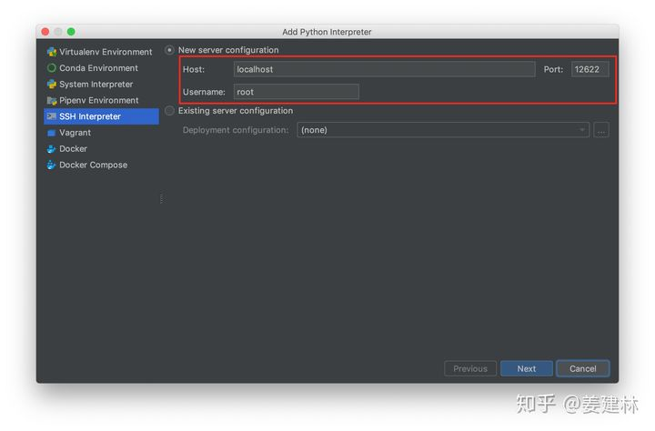
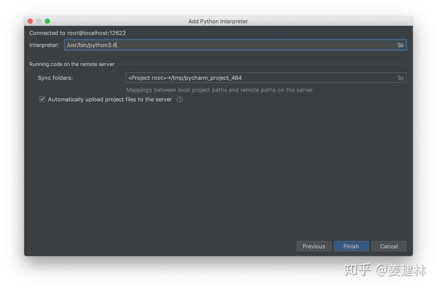
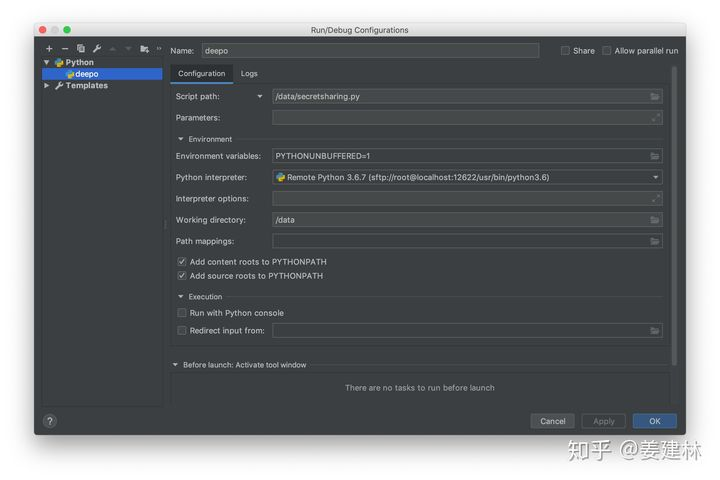
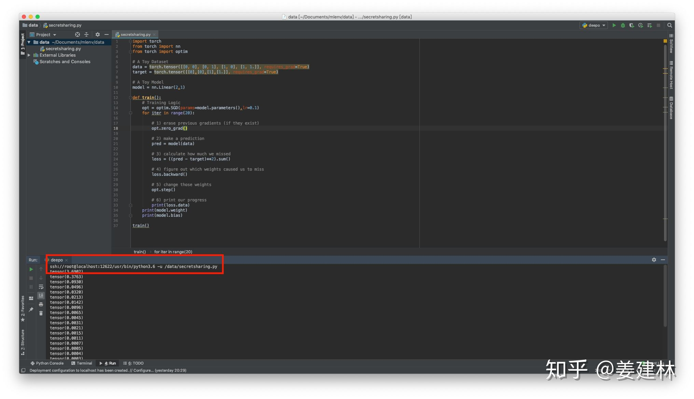

# Docker+PyCharm 快速搭建机器学习开发环境

[](https://www.zhihu.com/people/jiang-jian-lin-74)

转发自：[姜建林](https://www.zhihu.com/people/jiang-jian-lin-74)

CS 研究生

162 人赞同了该文章

本文介绍使用 Docker 容器结合 PyCharm 快速搭建机器学习类任务开发环境。机器学习的开发往往会涉及到很多 python 的包，环境的搭建和维护是一件头疼的事，使用 Docker 现成的机器学习工具 Deepo 能跳过环境搭建的过程，再结合 PyCharm 可以实现本地开发调试。本文在 Mac 上做的尝试，linux 操作系统同理，windows 也有相应的 docker 软件使用，Pycharm 的设置都是相似的。最终的效果是省略环境搭建的步骤，使用 PyCharm 进行代码的开发和调试。

## Docker

Docker 是一种容器技术，类似于虚拟机，但比虚拟机更轻便。Docker 容器内的应用程序直接运行于宿主的内核，而没有自己的内核，而且也没有硬件虚拟。更多 Docker 的相关知识可以看《Docker-从入门到实践》。

## Deepo

[Deepo](https://link.zhihu.com/?target=https%3A//github.com/ufoym/deepo)是一个包含一系列 Docker 镜像的项目，这些镜像中包含了 TensorFlow、Caffe 和 Torch 等多种深度学习框架。也就是说，在这些镜像中已经包含了大部分流行的机器学习框架，只需要将镜像下载到本地，运行容器即可直接使用这些框架。
  Deepo 提供了 GPU 和 CPU 版本的框架，这里使用的 mac 以 CPU 的镜像为例子，对于 GPU 版本的镜像需要先安装 Nvidia 官方的 nividia-docker 和相应版本的 NVIDIA 驱动。
   在 github 页面可以看到 Deepo 拥有众多的不同的镜像，以 tag 来区分，可以根据需要下载对应的镜像。这里以`docker pull ufoym/deepo:cpu`为例，这样会下载包含 cpu 版本的机器学习框架的镜像。

## Deepo-ssh 镜像

在有了 Deepo 镜像之后，为了方便使用，可以在 Deepo 镜像基础上配置 ssh 服务，以便于 mac 通过 ssh 连接登录到容器，以及 PyCharm 调用远程的 python 的 interpreter。
   登录到现有的 Deepo 容器，以`docker run -it ufoym/deepo:cpu bash`交互式的进入 deepo 容器中。
**配置容器 ssh 连接** 这一步可以使用 mac 通过 ssh 连接 ubuntu 容器。首先通过`apt-get install openssh-server`用于开启 ssh 服务的外部连接。
**配置 sshd** 修改 sshd 的默认配置，编辑文件`/etc/ssh/sshd_config`，修改文件中的以下三行：

```text
PermitRootLogin yes # 可以登录 root 用户
PubkeyAuthentication yes # 可以使用 ssh 公钥许可
AuthorizedKeysFile  .ssh/authorized_keys # 公钥信息保存到该文件中
```

**重启 sshd** `/etc/init.d/ssh restart`使得这些配置生效。
**添加 mac 的公钥到容器** 这一步是为了能免密码 ssh 登录到容器中。

1. 在容器中`mkdir ~/.ssh`
2. `touch ~/.ssh/authorized_keys`
3. 新开一个 mac 终端窗口，`ssh-keygen -t rsa -C "youremail@example.com"`（替换为你自己的邮箱），会在`~/.ssh`目录下生成三个文件`id_rsa`、`id_rsa.pub`、`known_hosts`。复制`id_rsa.pub`文件中的内容。
4. 将复制的内容粘贴到容器`~/.ssh/authorized_keys`文件中。

**提交修改到镜像** 以上对容器的修改并不会改变镜像文件，需要提交修改生成一个新的镜像。

1. `docker ps -a`查看刚刚使用 deepo 容器，记录下该容器的`CONTAINER ID`，例如`8b5a86d18e58`。
2. `docker commit -m 'add ssh' -a 'your-name' 8b5a86d18e58 deepo-ssh`这样会将刚刚在 deepo 容器中配置的 ssh 服务保存，并生成新的 deepo-ssh 镜像。在后续使用`docker images`命令可以查看到新的镜像已经被保存。

**运行最终的容器**
`docker run -d -p 12622:22 -v ~/data:/data -v ~/config:/config deepo-ssh /usr/sbin/sshd -D`

- -d | 后台运行
- -p 12622:22 | 绑定当前 mac 的 12622 端口到 deepo-ssh 容器的 22 端口（ssh 服务默认为 22 端口）
- -v ~/data:/data | 将 mac 的~/data 目录挂载到容器/data 目录
- /usr/sbin/sshd -D | 容器运行的命令和参数，开启 ssh 服务

这样就可以通过`ssh -p 12622 root@localhost`连接到容器，可以进入 python 解释程序，执行`import torch`等命令查看机器学习框架是否能正常使用。在`exit`退出 ssh 连接后，容器仍运行在后台。
   以上的操作是在 mac 本地，同样适合在一台远程的 linux 服务器上，部署一个 docker 容器。那么在 ssh 连接时，`localhost`就需要改为该服务器的公网或者内网 IP。同时本地的`~/data`和`~/config`目录和 deepo-ssh 容器中的`/data`和`/config`目录相互绑定。如果是远程服务器的情景，那么就是服务器上的目录和容器中的目录相互绑定，不再和本地 mac 有关。

### PyCharm+Docker

经过以上的操作，可以理解成本地 12622 端口开启了 ssh 服务，运行一个独立的 ubuntu 服务器。接下来介绍如何使用 PyCharm 调用 Docker 容器中的解释器。（注意需要 PyCharm 专业版）
在 Pycharm 中 PyCharm-->Project-->Project Interpreter，如下图所示：


点击右上按钮选择添加解释器。



选择`SSH Interpreter`，按图中内容。


选用 openssh 连接，并添加私钥文件。



选择 docker 容器内的 python 解释器。 这样在 PyCharm 写代码时就会调用已经包含机器学习框架的 python 解释器，能够代码提醒和智能补全。
接下来配置 Run/Debug Configurations，



如上配置，这里解释器是 docker 中的解释器，注意`Working Directory`是 docker 容器中的目录，这为`/data`，由于 docker 的设置，本机`~/data`和 docker 容器中的`/data`目录相映射，因此需要执行的文件可以放入本机`~/data`目录。以上就可以在 Pycharm 调用容器内的解释器以使用容器中已安装的机器学习框架，而且执行和调试可以在本地进行，提高开发效率。
   以上结合 Docker 和 PyCharm 快速搭建机器学习开发环境，这例子的情景是在 mac 后台运行容器，并将本机的端口映射到容器的 22 端口，实现 ssh 连接容器，并在 PyCharm 中调用容器的解释器，以实现本地的机器学习任务的开发调式。以上的模式对于一个远程的服务器同样适用，在服务器上创建 docker 容器并运行在后台，映射到服务器的一个端口。在 Pycharm 中调用远程服务器的解释器，并创建本地目录和服务器目录的映射（在 Deployment 配置），就可以实现在本地写代码和调试。

最终效果
