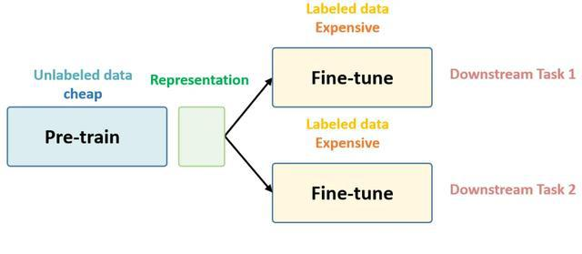
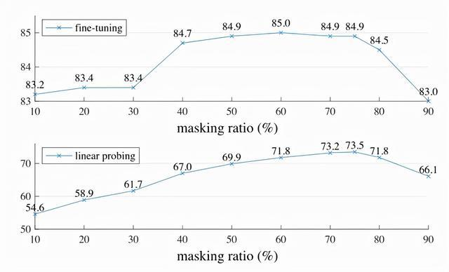
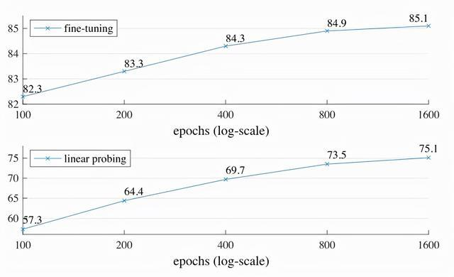

Self-Supervised Learning 超详细解读 (目录)：https://zhuanlan.zhihu.com/p/381354026

**Self-Supervised Learning**，又称为自监督学习，我们知道一般机器学习分为有监督学习，无监督学习和强化学习。而 Self-Supervised Learning 是无监督学习里面的一种，主要是希望能够学习到一种**通用的特征表达**用于**下游任务 (Downstream Tasks)**。其主要的方式就是通过自己监督自己。作为代表作的 kaiming 的 MoCo 引发一波热议， Yann Lecun 也在 AAAI 上讲 Self-Supervised Learning 是未来的大势所趋。所以在这个系列中，我会系统地解读 Self-Supervised Learning 的经典工作。

1 MAE

> 论文名称：Masked Autoencoders Are Scalable Vision Learners

**论文地址：**

https://arxiv.org/abs/2111.06377

计算机视觉领域的 GPT-3 要有了？Kaiming 在这篇论文中告诉我们：强大的 AI 技术 idea 应该非常简单，实现起来也很快捷。我们首先对 Self-supervised Learning 做个简单的回顾：

1.1 Self-supervised Learning

在预训练阶段我们使用**无标签的数据集 (unlabeled data)**，因为有标签的数据集**很贵**，打标签得要多少人工劳力去标注，那成本是相当高的，太贵。相反，无标签的数据集网上随便到处爬，它**便宜**。在训练模型参数的时候，我们不追求把这个参数用带标签数据从**初始化的一张白纸**给一步训练到位，原因就是数据集太贵。于是**Self-Supervised Learning**就想先把参数从**一张白纸**训练到**初步成型**，再从**初步成型**训练到**完全成型**。注意这是 2 个阶段。这个**训练到初步成型的东西**，我们把它叫做**Visual Representation**。预训练模型的时候，就是模型参数从**一张白纸**到**初步成型**的这个过程，还是用无标签数据集。等我把模型参数训练个八九不离十，这时候再根据你**下游任务 (Downstream Tasks)**的不同去用带标签的数据集把参数训练到**完全成型**，那这时用的数据集量就不用太多了，因为参数经过了第 1 阶段就已经训练得差不多了。

第一个阶段不涉及任何下游任务，就是拿着一堆无标签的数据去预训练，没有特定的任务，这个话用官方语言表达叫做：**in a task-agnostic way**。第二个阶段涉及下游任务，就是拿着一堆带标签的数据去在下游任务上 Fine-tune，这个话用官方语言表达叫做：**in a task-specific way**。

**以上这些话就是 Self-Supervised Learning 的核心思想**，如下图 1 所示，后面还会再次提到它。

图 1：Self-Supervised Learning 的核心思想

Self-Supervised Learning 不仅是在 NLP 领域，在 CV, 语音领域也有很多经典的工作，如下图 2 所示。它可以分成 3 类：**Data Centric, Prediction (也叫 Generative) 和 Contrastive**。

图 2：各个领域的 Self-Supervised Learning

其中的主流就是基于 Generative 的方法和基于 Contrative 的方法。如下图 3 所示这里简单介绍下。基于 Generative 的方法主要关注的重建误差，比如对于 NLP 任务而言，一个句子中间盖住一个 token，让模型去预测，令得到的预测结果与真实的 token 之间的误差作为损失。基于 Contrastive 的方法不要求模型能够重建原始输入，而是希望模型能够在特征空间上对不同的输入进行分辨。

图 3：基于 generative 的方法和基于 contrastive 的方法的总结图片

1.2 Masked AutoEncoders (MAE) 方法概述

这篇论文使用掩码自编码器 (masked autoencoders (MAE)) 进行自监督学习。根据 1.1 节的介绍，它属于 Generative (Predictive) pre-training 的类型。这种类型自监督学习的另一个著名的例子就是 BERT。

对于 BERT 模型而言，一个 sentence 中间盖住一些 tokens，让模型去预测，令得到的预测结果与真实的 tokens 之间的误差作为损失。它告诉了我们直接 reconstruct sentence 也可以做到很 work。

对于 MAE 模型而言，一个 image 中间盖住一些 patches，让模型去预测，令得到的预测结果与真实的 image patches 之间的误差作为损失。它告诉了我们直接 reconstruct image 原图也可以做到很 work。

上面的对比看上去很容易，但是问题在于：

**为什么 BERT (2018) 提出这么久以后，直到 BEIT (2021.6) 和 MAE (2021.11) 之前，一直在 CV 领域都没有一个很类似的 CV BERT 出现？**

> 这里 Kaiming 提出了 3 条看法：

1. **CV 和 NLP 主流架构不同：**直到 ViT (2020.12) 出现之前，CV 的主流架构一直是以卷积网络为主，NLP 的主流架构一直是以 Transformer 为主。卷积核作用在一个个的 grid 上面，直观来讲没法产生像 Transformer 一样的 token 的概念，也就是说如果我们只使用卷积网络，那么 image token 概念的建立就不那么直观。所以，像 Transformer 那样在 token 的基础上进行自监督学习就不太适用，**这是第一个难点**
2. **语言和图片 (视频) 的信息密度不同：**语言是人类造就的信号，它 highly semantic ， information-dense。而图片 (视频) 是自然产生的信号，它 heavy spatial redundancy。即挡住图片的一部分 patches，可以很容易地通过看它周围的 patches 而想象出它的样子来。所以，语言和图像，一个信息密度高，一个信息密度低，**这是第二个难点**。解决的办法是什么呢？作者提出了一个简单的策略：即挡住图片的 patches 的比例高一些。比如之前你挡住一张图片的 30% 的 patches，能够轻松通过周围的 patches 预测出来；那现在如果挡住图片的 90% 的 patches，还能够轻松通过周围的 patches 预测出来吗？
3. **AutoEncoder 里面的 Decoder 部分 (就是将映射得到的中间特征重建为 input 的模块) 在 CV 和 NLP 中充当的角色不同：**在 CV 领域，Decoder 的作用是重建 image pixels，所以 Decoder 的输出语义级别很低。在 NLP 领域，Decoder 的作用是重建 sentence words ，所以 Decoder 的输出语义级别很丰富。

这 3 条看法非常准确地展示了：为什么在 CV 领域搞出一个像 BERT 一样类似的 CV BERT 这件事比较难。

基于以上分析，作者提出了 MAE 方法，如下图 4 所示就是 MAE 的架构。MAE 的方法很简单：**Mask 掉输入图像的随机的 patches 并重建它们。它基于两个核心理念：研究人员开发了一个非对称编码器 - 解码器架构，其中一个编码器只对可见的 patch 子集进行操作**(即没有被 mask 掉的 token)，另一个简单解码器可以从**潜在表征和被 masked 掉的 token**重建原始图像。Decoder 的架构可以是十分轻量化的模型，且具体的架构对模型性能影响很大。研究人员进一步发现，Mask 掉大部分输入图像 (例如 75%) 会产生重要且有意义的自监督任务。结合这两种设计，我们就能高效地训练大型模型：提升训练速度至 3 倍或更多，并提高准确性。

图 4：MAE 自监督学习架构

MAE 方法严格来讲属于一种去噪自编码器 (Denoising Auto-Encoders (DAE))，去噪自动编码器是一类自动编码器，它破坏输入信号，并学会重构原始的、未被破坏的信号。MAE 的 Encoder 和 Decoder 结构不同，是非对称式的。Encoder 将输入编码为 latent representation，而 Decoder 将从 latent representation 重建原始信号。

MAE 和 ViT 的做法一致，将图像划分成规则的，不重叠的 patches。然后按照均匀分布不重复地选择一些 patches 并且 mask 掉剩余的 patches。作者采用的 mask ratio 足够高，因此大大减小了 patches 的冗余信息，使得在这种情况下重建 images 不那么容易。

1.3 MAE Encoder：

MAE Encoder 采用 ViT 架构，但只会作用于 unmasked images。和 ViT 思路一样，MAE Encoder 会先通过 Linear Projection 编码图片，再加上位置编码，随后送入一堆连续的 Transformer Block 里面。但是编码器只对整个图片 patches 集合的一个小子集 (例如 25%)进行操作，而删除 masked patches。这里和 BERT 做法不一样，BERT 使用对于 mask 掉的部分使用特殊字符，而 MAE 不使用掩码标记。

1.4 MAE Decoder：

MAE Decoder 采用 Transformer 架构，输入整个图片 patches 集合，不光是 unmasked tokens (图 4 中蓝色色块)，还有被 mask 掉的部分 (图 4 中灰色色块)。每个 mask tokens 都是一个共享的、学习的向量，它指示了这里有一个待预测的 tokens。作者还将位置嵌入添加到这个完整 image patch 集合中的所有 tokens 中，位置编码表示每个 patches 在图像中的位置的信息。

MAE Decoder 仅用于预训练期间执行图像重建任务。因为自监督学习的特点就是只用最后预训练好的 Encoder 完成分类任务。因此，可以灵活设计与编码器设计无关的解码器结构。作者用比编码器更窄更浅的很小的解码器做实验。在这种非对称的设计下，tokens 就可以由轻量级解码器处理，这大大缩短了预训练的时间。

1.5 自监督学习目标函数 Reconstruction Target：

Decoder 的最后一层是一个 Linear Projection 层，其输出的 channel 数等于图像的像素 (pixel) 数。所以 Decoder 的输出会进一步 reshape 成图像的形状。损失函数就是 MSE Loss，即直接让 reconstructed image 和 input image 的距离越接近越好。

作者还尝试了另外一种损失函数，就是先计算出每个 patch 的像素值的 mean 和 deviation，并使用它们去归一化这个 patch 的每个像素值。最后再使用归一化的像素值进行 MSE Loss 计算。但是发现这样做的效果比直接 MSE Loss 好。

1.6 具体实现方法：

MAE 的具体实现方法是：

1. 首先通过 Linear Projection 和位置编码得到 image tokens。
2. 随机 shuffle 这些 tokens，按照 masking ratio 扔掉最后的一部分。
3. 把 unmasked patches 输出到 Encoder 中，得到这些 tokens 的表征。
4. 把 Encoder 的输出，结合 masked tokens (可学习的向量)，执行 unshuffle 操作恢复顺序，再一起输入到 Decoder 中。
5. shuffle 和 unshuffle 操作的时间开销可忽略不计。

1.7 ImageNet 实验结果：

第 1 个实验使用 ViT-Large (ViT-L/16) 作为 Encoder 的 Backbone，作者首先对比了 3 个结果，如下图 5 所示：

图 5：ImageNet 实验结果

- 76.5 是 ViT 论文 report 的 ViT-Large 使用 ImageNet 训练的结果。
- 82.5 是作者自己实现的，ViT-Large 使用 ImageNet 训练的结果，这里不得不佩服 Kaiming 强大的实验能力啊，单训 ViT 就能比原作者高出 6 个点来，作者认为要使用较大的 weight decay = 0.3。82.5 的实验设置如下图 6 所示。
- 84.9 是作者自己实现的，ViT-Large 使用 MAE pretrain 之后，再在 ImageNet 上做完整 Fine-tuning 的结果，可以看到优于有监督的 82.5。

图 6：82.5 的实验设置

1.8 masking ratio 对性能的影响：

如下图 7 所示代表了 masking ratio 对结果的影响。最优的 masking ratio 竟然出乎意料地高，且当 masking ratio=75% 时，linear probing 和 fine-tuning 的性能依旧很高。这种行为与 BERT 相反，BERT 的典型 mask ratio 只有 15%。从这个结果可以得出结论：MAE 自监督训练好的模型可以**推断出**缺失的补丁。作者假设这种类似推理的行为，与学习有用的表征有关。

图 7 还显示了 linear probing 和 fine-tuning 的结果随着的不同的变化趋势。对于 fine-tuning，结果是 40-80%的 masking ratio 都能 work well。

图 7：masking ratio 对结果的影响

1.9 观察到的一些实验现象：

如下图 8 所示，作者做了一些不同实验设置下的对比实验。

图 8：观察到的一些实验现象

**图 8 (a)：**足够深的 Decoder 对于 linear probing 很重要。原因：pixel reconstruction task 和 recognition task 本质不同，AutoEncoder 的末尾几层对于重建 pixel 更重要。而且有趣的是，只有 1 层 Block 的 Decoder 在 fine-tuning 之后就能达到 84.8%的 accuracy。默认配置是 8 层。

**图 8 (b)：**更窄的 Decoder 也能够在 fine-tuning 时获得较好的性能。默认配置是 Embedding dimension=512。

计算量只有 ViT-L 的 9%。

**图 8 (c)：**研究有没有必要在输入 Encoder 的时候一并输入 masked patches。结果发现，如果也一起给 Encoder 输入了 mask tokens，效果其实是变差的：Linear Probing 性能降低了 14%。作者认为，这可能是因为：**在这种情况下，在预训练和部署之间存在差距。**即：编码器在预训练的输入中有很大一部分是 mask tokens，这在未损坏的图像中是不存在的。这个 gap 可能会降低部署的准确性。

而且，通过跳过编码器中的 mask token，大大减少了训练计算量 (约 3.3 倍)。此外，GPU memory 大大减少，这可以使训练更大的模型或加快 large-batch training。时间和 GPU memory 效率使我们更适合训练大型模型。

**图 8 (d)：**不同损失函数的影响。除了 MSE Loss 以外，作者还尝试了另外一种损失函数，就是先计算出每个 patch 的像素值的 mean 和 deviation，并使用它们去归一化这个 patch 的每个像素值。最后再使用归一化的像素值进行 MSE Loss 计算。但是发现这样做的效果比直接 MSE Loss 好。

**图 8 (e)：**不同数据增强策略的影响。MAE 只使用 cropping-only 就比较好，而进一步添加 color jittering 会影响性能。即使没有使用数据增强 (only center-crop, no flipping) ，MAE 模型仍然能够表现得体。作者也给出了原因，即：在 MAE 中，数据增强的角色其实是由 random masking 来扮演的。每个 iteration 的 mask 都不同，所以就相当于是产生了新的训练样本。

**图 8 (9)，图 9：**不同 mask 采样策略的影响。block-wise masking 在 mask 50%时的效果还行，但是当 mask ratio 达到 75%时性能就大幅下降了。grid-wise sampling 使得任务变得更简单，但相应的，图像重建质量也下降了。简单的随机抽样最适合 MAE 模型。

图 9：不同 mask 采样策略的影响

1.10 训练策略：

下图 10 展示了不同 training epochs 的影响。在 training epochs=1600 时 MAE 还没有达到饱和。

图 10：不同 training epochs 的影响

1.11 结果对比：

如下图 11 所示为不同自监督方法性能对比，对于 ViT-B 模型，所有的方法性能相似，但是对于更大的 ViT-L 模型，性能差距就拉开了，证明了 MAE 对于大模型的泛化性能。

图 11：不同自监督方法性能对比

使用 ViT-H 结构的 Encoder，经过 448 fine-tuning 之后可以得到 87.8% 的 Accuracy，而整个过程只使用了 ImageNet 数据集。

与 BEiT 相比，MAE 更快，训练方式更简单，MAE 重建 pixel，而 BEiT 重建 tokens。图 11 中的模型是为了更高的精度预先训练的 1600 epochs 的模型。即便如此，如果他们在同样的硬件环境下训练，我们总的训练前时间比其他任何方法都短。例如，对于 ViT-L，MAE 的训练时间是 1600 个 epochs，31 小时。moco v3 的训练时间是 300 个 epochs，36 小时，使用相同的 128 个 TPU-v3 核心。

1.12 Partial Fine-tuning

最后，作者提出了一种 Partial Fine-tuning 的新套路，它不同于之前人们常用的**Linear Probing (只训练最后一层线性分类器的参数)**和**Fine-tuning (训练所有层的参数)**。

**Partial Fine-tuning**是指**只训练最后模型的若干层的参数**。如下图 12 所示，值得注意的是，Fine-tuning 1 个 Transformer Block 可以把 Accuracy 从 73.0%提升至 81.0%。此外，如果我们只 Fine-tuning 1 个 Transformer Block 的 MLP block，我们可以得到 79.1% ，比 Linear Proing 要好得多。

图 12：Partial Fine-tuning

总结

用 MAE 做 pre-training 只需 ImageNet-1k 就能达到 87.8% 的 Top-1 准确度，超过了所有在 ImageNet-21k pre-training 的 ViT 变体模型。而从方法上看，MAE 选择直接重建原图的元素，而且证明了其可行性，改变了人们的认知，又几乎可以覆盖 CV 里所有的识别类任务，看起来像是开启了一个新的方向。直接重建原图的元素是非常重要的，因为通过这个形式，作者就用最最直观的方式完成了 MIM 任务，使得 MIM 的潜力逐步被证实。从 MLM 到 MIM 的过渡已被证明，由此观之比肩 GPT3 的 CV 预训练大模型已不远矣。
