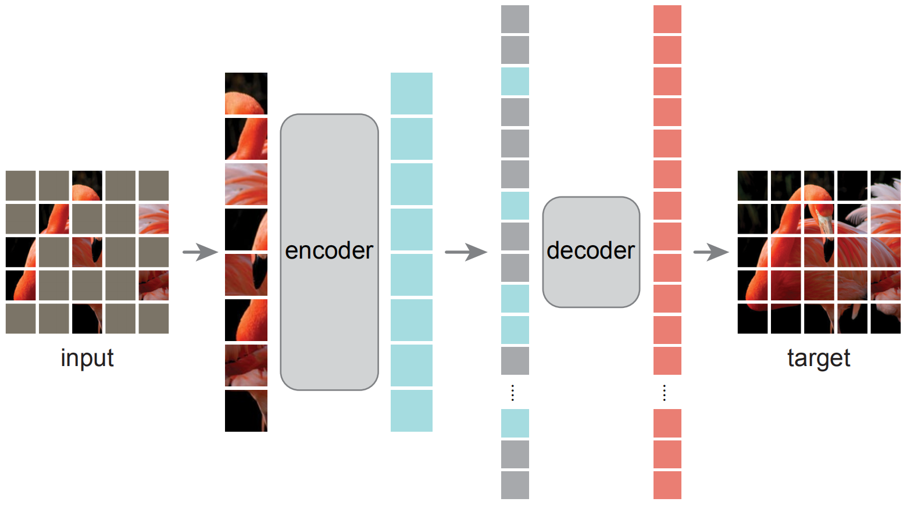
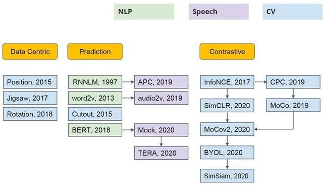

# Masked Autoencoders are Scalable Vision Learners

读完了各种各样花招百出的 Transformer 和 MLP 的文章之后，整个人是眼前一亮的。整篇文章读下来，没有任何花招（甚至没有数学公式），只是单纯给你讲了一个故事，一个 MAE 的故事。

虽然 128 块 TPUv3 的算力无法企及，但是其水平还是可以领会一下的

首先摘要非常简单扼要，毫无无病呻吟，看起来十分清爽：

> This paper shows that masked autoencoders (MAE) are scalable self-supervised learners for computer vision. Our MAE approach is simple: we mask random patches of the input image and reconstruct the missing pixels. It is based on two core designs. First, we develop an asymmetric encoder-decoder architecture, with an encoder that operates only on the visible subset of patches (without mask tokens), along with a lightweight decoder that reconstructs the original image from the latent representation and mask tokens. Second, we find that masking a high proportion of the input image, e.g., 75%, yields a nontrivial and meaningful self-supervisory task. Coupling these two designs enables us to train large models efficiently and effectively: we accelerate training (by 3× or more) and improve accuracy. Our scalable approach allows for learning high-capacity models that generalize well: e.g., a vanilla ViT-Huge model achieves the best accuracy (87.8%) among methods that use only ImageNet-1K data. Transfer performance in downstream tasks outperforms supervised pretraining and shows promising scaling behavior.

这篇摘要简洁就在于第一句没有提前人的工作，而是直入主题：这篇文章说明 MAE 是计算机视觉领域的自监督学习者。而我们的 MAE 方法也非常的 simple：我们把输入图片的 patch 遮住，试图重建这些像素。MAE 的设计中有两个核心概念：一个是 encoder-decoder 架构，另一个是 mask 掉一张图片的很大一部分是对模型的自监督能力的一个挑战。二者结合后，不仅训练速度是之前的三倍，而且准确率也有提升。并且模型的泛化能力也很强，训练出的 ViT-Huge 可以做到 87.8%的准确率。并且下游任务的表现也很好。

摘要上来就很不走寻常路，没有提及之前的工作，而是直接介绍自己的结果。

## autoencoding

自编码器是是学习表达的经典方法。PCA、k-means 和 Denoising Autoencoders 都是典型的自编码器。对于图像，mask 掉像素或通道都是训练 autoencoder 的方法。

## 方法

模型的概念图如下：

作者采用了**非对称的 encoder-decoder**架构，模型由一个全量的`ViT`作为 encoder，一个简单的 decoder。

对每一张输入图片，先分 patch，按一定比例随机 mask 掉一大部分 patch，只有被保留下来的 patch 加上 positional encoding 进入 encoder。对每一个 patch，encoder 输出一个隐含表示。这些表示（向量），补上 mask 的向量表示，拼接上 decoder，送入 decoder 中，输出最后结果。decoder 是另外一系列 transformer。decoder 的最后一层是一层全连接，输出和每个 patch 里的像素数一致，用于预测像素。损失函数是 MSE，只对于被 mask 掉的 patch 求。

在非监督学习中，主要有 Generative 和 Contrastive 两种方式，基于 Generative 的方法需要模型重建原始模式，而基于 Contrastive 的方法不要求模型能够重建原始输入，而是希望能在特征空间上对不同的输入进行分辨。

在自监督领域，有过很多探索，但主要是集中在语言语音处理中，而计算机视觉主要关注在 Contrastive 方法。

这篇论文使用掩码自编码器 (masked autoencoders (MAE)) 进行自监督学习。根据 1.1 节的介绍，它属于 Generative (Predictive) pre-training 的类型。这种类型自监督学习的另一个著名的例子就是 BERT。

对于 BERT 模型而言，一个 sentence 中间盖住一些 tokens，让模型去预测，令得到的预测结果与真实的 tokens 之间的误差作为损失。它告诉了我们直接 reconstruct sentence 也可以做到很 work。

对于 MAE 模型而言，一个 image 中间盖住一些 patches，让模型去预测，令得到的预测结果与真实的 image patches 之间的误差作为损失。它告诉了我们直接 reconstruct image 原图也可以做到很 work。

但上述对比的问题在于：为什么 BERT (2018) 提出这么久以后，直到 BEIT (2021.6) 和 MAE (2021.11) 之前，一直在 CV 领域都没有一个很类似的 CV BERT 出现？

作者在文中提出了三条观点：

1. 主流架构不同，Transformer 最近逐渐在 CV 展示身手，在此之前 CNN 中难以进行分 patch 的学习
2. 语言与图片的信息密度不同。语言是人造的信号，是信息的高度浓缩；而视觉是自然信号，其中的信息十分稀疏
3. Decoder 部分职能不同：在 NLP 中，Decoder 需要输出单词，语义级别很丰富，而图像中，Decoder 逐像素预测，语义级别很低
4.

MAE 和 ViT 的做法一致，将图像划分成规则的，不重叠的 patches。然后按照均匀分布不重复地选择一些 patches 并且 mask 掉剩余的 patches。作者采用的 mask ratio 足够高（高过 75%），因此大大减小了 patches 的冗余信息，使得在这种情况下重建 images 不那么容易。同时，极高的 mask ratio 让模型的输入大大减少，加速了训练。

### Training

首先作者训练了 Vision Transformer，第一项是原始配置，第二项是本文作者调整后的配置，第三项是 MAE 的配置。

回忆起最近读过的 Transformer 文章，大多是对着某个小点一通魔改，改出了一两个点，就放在 arXiv 上说我们有了新发现，结果就是被人家真正从全局来看问题写文章的研究者的发现秒杀。

用很巧妙的方式解决了一大问题：公开的有标签数据有限，进行标记的人工成本极高。而这种解决方式并不需要对模型的结构进行改变，而是采用无监督预训练的方式。

目前，计算机视觉大量以来有标签数据，而自监督学习没有得到

## 意义

使用 Masked Autoencoder 进行预训练成为可行，可以吸引研究者更加深入地研究。

## 抛出的问题

Transformer 在其中到底在哪方面起到了多少作用？

如果没有 Transformer，这种结构效果如何？CNN、或者 MLP 呢？
