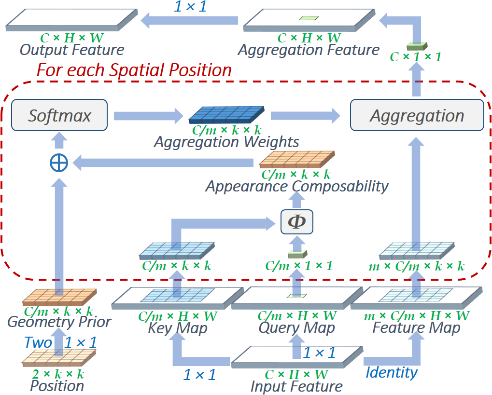

> 各位小伙伴们，大家下午好。下周四（2021年11月26日）我将进行研读论文的题目是《Res2Net: A New Multi-Scale Backbone Architecture》和《Swin Transformer: Hierarchical Vision Transformer Using Shifted Windows》，论文PDF已上传至群文件，请感兴趣的小伙伴自行查阅。

[http://scuvis.org/2021autumnpaper-1202/](http://scuvis.org/2021autumnpaper-1202/)

```tex
@InProceedings{Liu_2021_ICCV,
    author    = {Liu, Ze and Lin, Yutong and Cao, Yue and Hu, Han and Wei, Yixuan and Zhang, Zheng and Lin, Stephen and Guo, Baining},
    title     = {Swin Transformer: Hierarchical Vision Transformer Using Shifted Windows},
    booktitle = {Proceedings of the IEEE/CVF International Conference on Computer Vision (ICCV)},
    month     = {October},
    year      = {2021},
    pages     = {10012-10022}
}
```

Transformer是在自然语言处理领域大获成功的RNN模型，并且在计算机视觉任务中也表现出优异的成绩。但是，相较于文本，视觉实体的尺度变化更大、分辨率更高等特点，都给Transformer的在计算机视觉上的应用带来了挑战。为了解决此问题，作者提出了一种层级化的Transformer网络，并使用Shifted Windows方法进行representation的计算。Shifted Windows（简称Swin）方法将自注意力的计算限制在不重叠的局部窗口中，通过shifted window方法实现跨窗口信息连接。网络的层级化结构使得网络能够适应多种尺度的视觉目标，并且Swin的计算只有线性时间复杂度。以Swin Transformer作为骨干网络的模型在多个计算机视觉任务中取得了SOTA的成绩。

## 背景引入

研究动机

>  to expand the applicability of Transformer such that it can serve as a general-purpose backbone for computer vision, as it does for NLP and as CNNs do in vision.

相较于CV界各种维度、各种残差连接、各种计算层（研究结构、研究单层（depth wise convolution [70] and deformable convolution [18, 84].））的卷积神经网络百花齐放，NLP界的Transformer一枝独秀。Transformer具有强大的学习数据中长期依赖的能力，在以往的研究中，将Transformer迁移到计算机视觉领域取得了成功，但在CV任务上完全发挥Transformer的能力有很大挑战，主要有两点：1. 在NLP中，文字的token即为实体的最小元素；而在CV中，一个实体可以由几个到几万个像素表达；2. 在基于Transformer的模型中，token的大小处于固定不变的尺度，但在CV中不是如此，甚至在场景分割等任务中需要预测每一个像素点所属类别，Transformer计算量过大而不可行。

### Transformer

要理解文中的Swin Transformer，需要先了解Transformer和Vision Transformer。


$$
\mathrm{Attention}(Q, K, V) = \mathrm{softmax}(\frac{QK^T}{\sqrt{d_k}})V
$$


> Vaswani, A., Shazeer, N., Parmar, N., Uszkoreit, J., Jones, L., Gomez, A. N., Kaiser, Ł., & Polosukhin, I. (2017). Attention is all you need. *Advances in Neural Information Processing Systems*, *2017-December*.

#### Self-attention based

卷积神经网络的本质是特征提取，但卷积并不是最好的特征提取器（其实没有最好），一定程度上因为卷积核大小固定，难以提取图像的多尺度信息

在2019年微软亚洲研究研究院的LR-Net，在26层的LR-Net超过26层的ResNet 3个百分点




> H. Hu, Z. Zhang, Z. Xie and S. Lin, "Local Relation Networks for Image Recognition," 2019 IEEE/CVF International Conference on Computer Vision (ICCV), 2019, pp. 3463-3472, doi: 10.1109/ICCV.2019.00356.

滑动窗口访问内存的随机性导致计算性能并不好

#### Transformers to complement CNNs


### ViT & ResNe(X)t


> Is, M., For, R., & At, E. (2021). An image is worth 16x16 words. *The International Conference on Learning Representations*.

Vision Transformer将图像分割成小patch，将每个patch当成Transformer encoder中的输入序列，达到了极佳的速度-精度平衡。ViT通常需要很大的数据集（JFT-300M）才能达到比较好的效果。

但是，ViT并不适合用作general purpose backbone，因为图像都是稠密的，当输入图像分辨率很高时，每个patch得到的信息将会变少，同时在$O(n^2)$（$n$为图像大小）复杂度下算力消耗大。

虽然Swin Transformer不一定是最能刷榜的，但是是最有思想的。

> Xie, S., Girshick, R., Dollár, P., Tu, Z., & He, K. (2017). Aggregated residual transformations for deep neural networks. In *Proceedings - 30th IEEE Conference on Computer Vision and Pattern Recognition, CVPR 2017* (Vol. 2017-January, pp. 5987–5995). Institute of Electrical and Electronics Engineers Inc. https://doi.org/10.1109/CVPR.2017.634

### To overcome…

hierachical feature maps => conveniently leverage advanced techniques for dense predicion such as FPN or U-Net

shifted windows

linear complexity to image size <= The numbers of patches in each window is fixed (previous: quadratic)

## Method

Swin Transformer Tiny结构如(a)，选取$4\times4$大小的patch（3个通道，一共48个像素），Linear Embedding（是个全连接层吗？看代码）将patch投影成一个$C$维向量。Stage 1的Swin Transformer Block维护一定数量的$\left(\frac H4 \times \frac W4\right)$的token。

为了得到层级式的表达，token的数目在每两个Swin Transformer Block之间会经过Patch Merging减到原来的$1/4$，也就是$2\times 2$的patch会被融合成一个$4C$大小的向量，然后经过一个全连接（linear layer），输出维度为$2C$的向量。Stage 2的Swin Transformer Block的分辨率就是$\left(\frac H8 \times \frac W8\right)$；Stage 3和4与2相同，所以他们的输出分别是$\left(\frac H{16} \times \frac W{16}\right)$和$\left(\frac H{32} \times \frac W{32}\right)$。该网络可以和ResNet、VGGNet产生相同分辨率的feature map，可以方便地替换之而成为新的backbone。

介绍了Swin Transformer之后，我们介绍其中最重要的，Swin Transformer Block。STB将传统Attention机制中的多头自注意力模块换成了Shifted Window模块。在(b)中，STB包括一个LayerNorm块，一个基于多头自注意力机制的Swin块，又一个LayerNorm块，最后一个两层的、中间一个GELU激活函数的多层感知机。


### key design

理解这个<i>shift<b>ed</b></i>，注意用的是shifted而不是sliding或shifting，是现在完成时而不是进行时，所以在神经网络训练过程中是不会出现shift这个操作的，这个我最开始也没想明白。

 all *query* patches within a window share the same *key* set1 ,


### 计算复杂度问题

对于将图像用于Transformer来说，由于Transformer处理的是序列。如果要处理一张$H\times W$的图像，需要将图像当成序列输入，将图像切分为$h \times w$的patch，MSA的时间复杂度可以表示为
$$
\Omega(\textrm{MSA}) = 4hwC^2+2\left(hw\right)^2C
$$
而如果将图像划分为若干个patch，每个window中有$M\times M$个patch，这种Window-MSA的时间复杂度为
$$
\Omega(\textrm{W-MSA}) = 4hwC^2+2M^2hwC
$$
MSA对$hw$是平方级，而W-MSA对$hw$是线性级，这就很好地处理了随着图像分辨率的提高造成的计算复杂度快速上升的问题。

**提问：它对$M$不是平方级的吗？$M$不会增大吗？**

### Shifted Windows

在单个Window-based self-attention模块中没有跨Window的连接。

下一块中，作者对window进行了$\left(\lfloor\frac M 2\rfloor, \lfloor\frac M 2 \rfloor\right)$的位移（displace）。

所以，连续两层的Swin transformer的计算可以如下表示：
$$
\begin{aligned}
&\hat{\mathbf{z}}^{l}=\textrm{W-MSA}\left(\textrm{LN}\left(\mathbf{z}^{l-1}\right)\right)+\mathbf{z}^{l-1} \\
&\mathbf{z}^{l}=\operatorname{MLP}\left(\textrm{LN}\left(\hat{\mathbf{z}}^{l}\right)\right)+\hat{\mathbf{z}}^{l} \\
&\hat{\mathbf{z}}^{l+1}=\operatorname{SW-MSA}\left(\textrm{LN}\left(\mathbf{z}^{l}\right)\right)+\mathbf{z}^{l} \\
&\mathbf{z}^{l+1}=\operatorname{MLP}\left(\textrm{LN}\left(\hat{\mathbf{z}}^{l+1}\right)\right)+\hat{\mathbf{z}}^{l+1}
\end{aligned}
$$
$\hat{\mathbf z}^l$指第$l$层(S)W-MSA输出的特征向量，$\hat{\mathbf z}^l$指第$l+1$层MLP输出的特征向量

但是可以看到，Shifted window会产生更多的window，也就是周围一圈大小小于$M\times M$的window，故采用cylic shifting，也就是，循环移位，也就是，一个window里有好多sub-window，然后在self-attention计算的时候将sub-window使用mask提取出来。

### 相对偏置

在计算自注意力时，相较于原方法，在每个头上加了一个relative position embedding的偏置$B \in \mathbb{R}^{M^2\times M^2}$的偏置，修正后的公式如下：
$$
\operatorname{Attention}(Q, K, V) = \operatorname{SoftMax}(\frac{QK^\top}{\sqrt{d}}+B)V
$$
$d$是*query/key* dimension

### 结构变种

上文介绍主要基于Swin Transformer Tiny，还有Small，Big，Large等大小。<del>（移动端的，PC端的，服务器端的，用来刷榜的）</del>

## 实验结果

在各数据集上的测试、与ViT、ResNeXt的对比、消融实验（Ablation study），略

## 总结


代码解读可参考：https://zhuanlan.zhihu.com/p/401661320

Marr Prize
