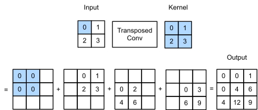

# UNet 3+

浙大的论文，非要用英文写，想要看懂还得翻译回来，难受。

## 先导知识

### `Up-Sampling`

There are four major ways of upsampling: bilinear interpolation, transposed convolution, unpooling and dilated convolution.

#### Bilinear Interpolation

假设我们想得到未知数$f$在点$P=(x, y)$处的值，已知函数$f$在$Q_{11}=(x_1, y_1)$, $Q_{12}=(x_1, y_2)$, $Q_{21}=(x_2, y_1)$, $Q_{22}=(x_2, y_2)$四个点的值，首先在$x$方向进行差值，得到
$$
f(R_1) \approx \frac{x_2-x}{x_2-x_1}f(Q_{11})+\frac{x-x_1}{x_2-x_1}f(Q_{21})\quad \text{where}\quad R=(x, y_1)
$$

$$
f(R_2) \approx \frac{x_2-x}{x_2-x_1}f(Q_{12})+\frac{x-x_1}{x_2-x_1}f(Q_{22})\quad \text{where}\quad R=(x, y_2)
$$

然后在$y$方向进行线性插值
$$
f(P) \approx \frac{y_2-y}{y_2-y_1}f(R_1) + \frac{y-y_1}{y_2-y_1}f(R_2)
$$

#### Deconvolution

Deconvolution又称Transposed Convolution

假设我们有一个$3 \times 3$的卷积核，
$$
k = \pmatrix{
	w_{0, 0} & w_{0, 0} & w_{0, 0} \\
	w_{0, 0} & w_{0, 0} & w_{0, 0} \\
	w_{0, 0} & w_{0, 0} & w_{0, 0}
}
$$
TODO: 用一张纸算算这些$w$都是哪跟哪
$$
\begin{pmatrix}
w_{0,0} & 0 & 0 & 0 \\
w_{0,1} & w_{0,0} & 0 & 0 \\
w_{0,2} & w_{0,1} & 0 & 0 \\
0 & w_{0,2} & 0 & 0 \\
w_{1,0} & 0 & w_{0,0} & 0 \\
w_{1,1} & w_{1,0} & w_{0,1} & w_{0,0} \\
w_{1,2} & w_{1,1} & w_{0,2} & w_{0,1} \\
0 & w_{1,2} & 0 & w_{0,2} \\
w_{2,0} & 0 & w_{1,0} & 0 \\
w_{2,1} & w_{2,0} & w_{1,1} & w_{1,0} \\
w_{2,2} & w_{2,1} & w_{1,2} & w_{1,1} \\
0 & w_{2,2} & 0 & w_{1,2} \\
0 & 0 & w_{2,0} & 0 \\
0 & 0 & w_{2,1} & w_{2,0} \\
0 & 0 & w_{2,2} & w_{2,1} \\
0 & 0 & 0 & w_{2,2}
\end{pmatrix} ^ \intercal
$$

Q: 转置卷积会更新权值吗？反向传播公式？

#### Unpooling

That's comparably easier.

#### Dilated Convolution

### `Down-Sampling`

TODO: Tesla系列和GTX系列性能对比
