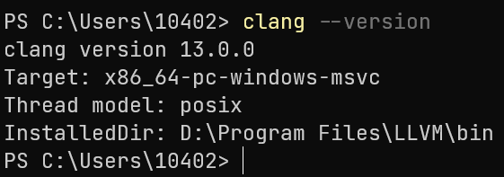
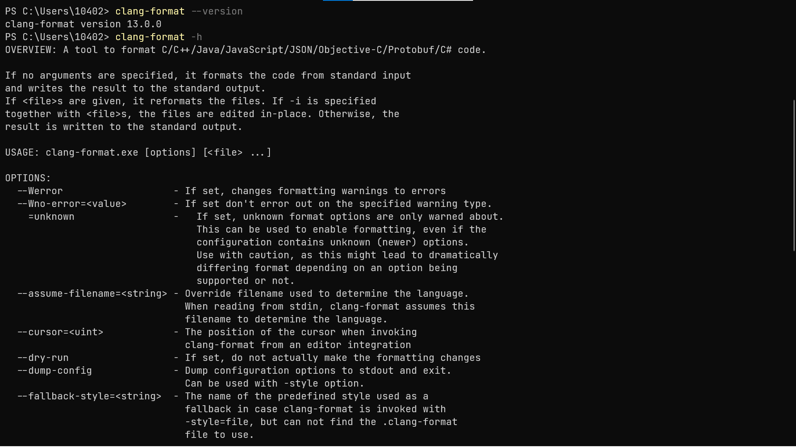

# Clang-Format

最近看各大开源项目的CONTRIBUTING文档时，发现大多数项目指明贡献的代码必须符合代码格式规范，著名的规范有`Google`等。 手动格式化代码，需要记忆许多条件，使得编程人员精力分散，所以产生了自动化格式化代码工具，最著名的有[`Clang-Format`](https://clang.llvm.org/docs/ClangFormatStyleOptions.html)，它是`LLVM`计划中`Clang`下的一个项目。

## 下载安装`LLVM`

Apache 2.0开源，https://github.com/llvm/llvm-project/releases/tag/llvmorg-13.0.0

我下载了[Windows 13.0](https://github.com/llvm/llvm-project/releases/download/llvmorg-13.0.0/LLVM-13.0.0-win64.exe)版本，安装**注意勾选添加到PATH环境变量**，其他一直Next就好。





然后我们就安装好了`Clang-Format`.

## 使用

切换到项目根目录下，执行

```powershell
clang-format -style=google -dump-config >> .clang-format
```


以下内容Credit to: https://www.cnblogs.com/liuyunbin/p/11538267.html

常用命令如下：

- 预览规范后的代码

```
$ clang-format main.cc
```

- 直接在原文件上规范代码

```
$ clang-format -i main.cc
```

- 显示指明代码规范，默认为 LLVM

```
$ clang-format -style=google main.cc
```

- 将代码规范配置信息写入文件 .clang-format

```
$ clang-format -dump-config > .clang-format
```

- 使用自定义代码规范，规范位于当前目录或任一父目录的文件 .clang-format 或 _clang-format 中（如果未找到文件，使用默认代码规范）

```
$ clang-format -style=file main.cc
```

### 在 Vim 中使用

1. 查找文件 clang-format.py 所在的目录：

```
$ dpkg -L clang-format | grep clang-format.py
```

1. 在 .vimrc 中加入以下内容

```
function! Formatonsave()
  let l:formatdiff = 1
  py3f <path-to-this-file>/clang-format.py
endfunction
autocmd BufWritePre *.h,*.cc,*.cpp call Formatonsave()
```

**说明：**

1. 上述的内容表示：当使用 Vim 保存文件时，会按照当前目录 或 任一父目录的文件 .clang-format 或 _clang-format 指定的规范来规范代码（如果未找到文件，使用默认代码规范）
2. 上述 `<path-to-this-file>` 指的是 clang-format.py 的目录
3. `let l:formatdiff = 1` 的意思是只规范修改过的部分，可以用 `let l:lines = "all"` 取代，表示规范所有的内容
4. 在 Ubuntu 18.04 LTS 下，clang-format 的默认版本为 clang-format-6.0，clang-format-6.0 的 clang-format.py 使用的是 Python 3，而 Ubuntu 18.04 LTS 默认的 Python 版本为 Python 2.7，所以上面使用的是 py3f 而不是 pyf