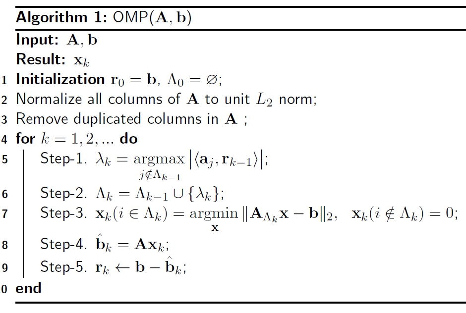

# 正交匹配追赶法

正交匹配追赶法（亦称为“正交匹配追踪法”），应用于压缩感知、稀疏编码领域，是一个兼具最优性和执行效率（以及易懂性）的贪心算法。我们面对一个稀疏感知中的问题：给定原向量 $b\in \mathbb{R}^n$ 和一个稀疏的字典 $A\in \mathbb{R}^{n\times m}(n\gg m)$，求得一个稀疏向量 $x\in\mathbb{R}^m$，使得

$$
Ax = b.
$$

显然，如果已知 $A$ 和 $x$，trivial；但已知 $A$ 和 $b$，$x$ 有无穷多个解。我们希望找到最稀疏的 $x$，即

$$
\underset{x}{\min}\ \| x \|_0
$$

设 $k \coloneqq \| x \|_0$ 为 $x$ 的稀疏度。因为 $x$ 尽可能稀疏，故 $A$ 中少量元素对 $b$ 有较大贡献。刻画 $A$ 中元素对 $b$ 贡献的方式可以通过投影计算。设 $A = [a_1, a_2, \ldots, a_m]$，由余弦定理可知

$$
\cos(a_i, b) = \frac{\langle a_1, b \rangle}{|a_i||b|}
$$

则投影可表示为

$$
|b|\cos(a_i, b) = \frac{\langle a_1, b \rangle}{|a_i|}
$$

若 $a_i$ 为单位向量，即对 $A$ 的列向量进行归一化，则上式进一步简化为

$$
x_i \coloneqq |b|\cos(a_i, b) = \langle a_1, b \rangle
$$

这样，每次能挑出贡献最大的一个向量，设为 $a_c$；选出 $a_c$ 后，将 $b \coloneqq b - a_c$，重复执行该算法；重复 $k$ 次就可以得到稀疏度为 $k$ 的向量 $x$。

> 其实可以做个动画演示的，当年大二《表达学习》课，老师的 PPT 上的动画真的很生动，一听就会了。



```matlab
% https://zhuanlan.zhihu.com/p/322180659
function [x] = OMP(A,b,sparsity)
%Step 1
index = []; k = 1; [Am, An] = size(A); r = b; x=zeros(An,1);
cor = A'*r;
while k <= sparsity
    %Step 2
    [Rm,ind] = max(abs(cor));
    index = [index ind];
    %Step 3
    P = A(:,index)*inv(A(:,index)'*A(:,index))*A(:,index)';
    r = (eye(Am)-P)*b; cor=A'*r;
    k=k+1;
end
%Step 5
xind = inv(A(:,index)'*A(:,index))*A(:,index)'*b;
x(index) = xind;
end
```

虽然总看到资料里讲它是最优的，但我还没明白它为什么最优。挖个坑 TODO，找到来补。

[^andersen]: Orthogonal Matching Pursuit Algorithm: A brief introduction. Andersen Ang. Department of Combinatorics and Optimization, University of Waterloo, Waterloo, Canada. <https://angms.science>
