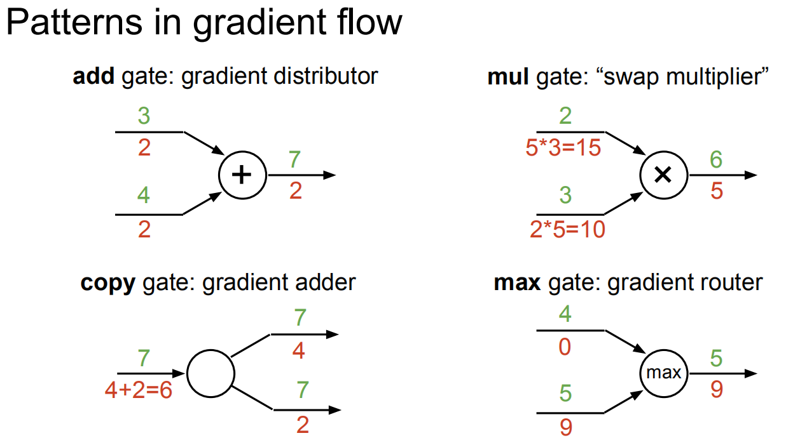

# 优化方法：随机梯度下降

如果将损失函数-输入的图绘制出来，将是高维空间中一张复杂的曲面，最优解就在曲面的底端。找到这个底端的方法有很多：随机搜索、区域中随机搜索、梯度下降法

### 随机搜索

非常浪费算力，而且效果不好

###区域中随机搜索

```python
W = np.random.randn(10, 3073) * 0.001 # generate random starting W
bestloss = float("inf")
for i in range(1000):
  step_size = 0.0001
  Wtry = W + np.random.randn(10, 3073) * step_size
  loss = L(Xtr_cols, Ytr, Wtry)
  if loss < bestloss:
    W = Wtry
    bestloss = loss
  print 'iter %d loss is %f' % (i, bestloss)
```

每次都试着向随机的方向走一小步，会好一些，但是盲目性还是非常大。如何降低盲目性？回忆起**梯度**的概念，梯度的方向是函数值上升最快的方向，其反方向就是下降最快的方向。

### 梯度下降

首先，为了获得梯度，可以采取数值方法和解析方法。数值方法要针对$W$的每一个分量进行计算，非常耗时耗力，但是实现简单，主要用于测试、解析方法利用**链式法则**，对梯度进行反向传播，实现了梯度的高效计算和权值的高效更新。


同时，由梯度的连式法则，可以将相连的多个算子看作一个进行求导


其中，各种算子在反向传播时表现出各自的性质：



==向量对向量的求导还没有学明白==