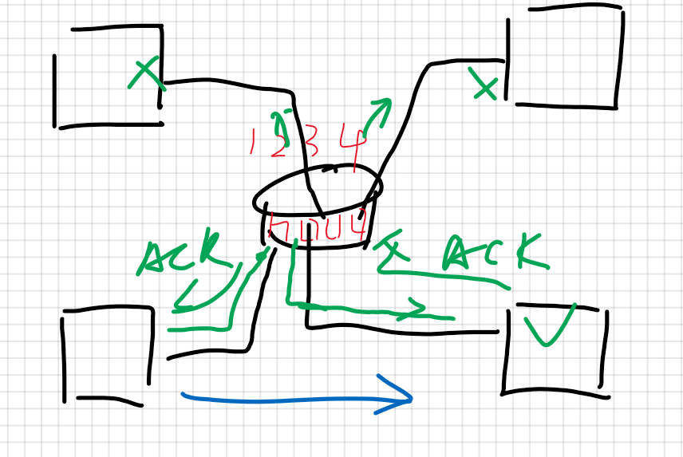

## 计算机网络基础

计算机网络——自底向上方法

（注：以下距离仅为教学使用，不代表网络真实发展


在很久很久以前，每台电脑都不直接和其他电脑联系，传输信息只能通过软盘。

你想和他人交流，所以，

有一天，一个人把一台电脑和另一台电脑用网线连了起来，它们通过神奇的方式开始通信了。

更多的电脑打算加入你的网络，你们两两建立了连接。


报文交换：


现在，假设A主机要向B主机发送消息，那么它只需要将数字信号调制成电信号从1端口送出去就可以了。这就实现了最简单的网络，只有两层：物理层和上层。

作战需要，我们要把每个部门都联系起来，需要接入的设备越来越多

这种全连接的网络越来越不现实，但仔细一想，你可以把**物理层**的**确定目标主机功能**分离出来。物理层只管发送，由一个唯一的序列决定接收设备。


这时A向B发送数据包


A把数据包装到“信封”里，从一个网口发送出去。因为这次用的是集线器，网线上的每一台设备都收到了消息。B看到数据是自己的，收下了；C、D、E看到不是，丢弃了。

对应到现在的网络，起到唯一标识作用的是**数据链路层**的**MAC地址**。MAC地址是由网络设备生产厂商在生产是烧写进设备的，在全世界范围内唯一。

下面假设A的MAC地址是AA:AA:AA:AA:AA:AA，B的MAC地址是BB:BB:BB:BB:BB:BB。


但是，这种做法既不安全，又浪费资源。所以，需要一种能充分利用MAC的性质的机器，交换机的任务就是这样。

通过手工配制，随着网络规模的增大十分不现实，所以都采用自动配置。

交换机工作在数据链路层，依靠内部建立的**地址转换表**根据包的地址将包发送到**对应的**目标中。最开始交换机刚刚接入网络时，假设A向B发送了数据包，其实是由1端口进入了交换机。交换机首先发现表中没有AA:AA这一项，将其加入表（AA:AA对应1号端口）发现路由表中**没有**BB:BB:BB:BB:BB:BB这一项，所以对除1以外的全部端口进行广播。C、D发现不是自己的数据包，将其丢弃；B收到了，返回一个相应。交换机根据2号端口收到的响应，确定BB:BB:BB:BB:BB:BB连接到2端口，写入路由表。由此你来我往，交换机就清楚了哪个端口对应哪个MAC地址。如果不相符，更新就完了。

这种通信方式建立起的网络，叫做**以太网**。



甚至，加入另一台交换机也更容易了，只需要把两台交换机用网线连起来就可以：

就比如，你把两台交换机连了起来：


但随之而来的问题是，映射表变复杂了，就比如新加入的交换机连接到了原来交换机的4号端口：

| MAC地址           | 端口 |
| ----------------- | ---- |
| EE:EE:EE:EE:EE:EE | 4    |
| FF:FF:FF:FF:FF:FF | 4    |
| ……                | 4    |
| ……                | 4    |
| ……                | 4    |
| ……                | 4    |

容易发现，甲交换机基本是把乙交换机的路由表复制了一份，只是，端口全是**4**。

你需要想，既然这么多发送到这么多主机的包都在同一个交换机下，那么用一个地址代替他们所有是不是更好？

很方便的做法是给交换机配一个地址，让它具有像主机一样的功能。

但是，随着分布式的网络越来越大，依靠广播机制越来越不可能；

甚至随着**多跳**的出现，交换机有呈现最初全连接的情况


丙（网段？）中一台主机要把数据发送到中一台设备，再采取这种广播机制既不安全，又浪费资源。

需要的是一种可以确定**网段**的东西。能不能用现有的MAC地址？如果两台设备的MAC地址的相同前缀越长，越能说明在同一网段，那就可以定向转发了。但现实不是这样。根据RFCXXXX，MAC地址是根据设备厂商确定的。所以，两个MAC地址非常相近的设备，可能被卖到了世界上的两个角落。

所以，把确定网段的工作再抽象一层，称为**网络层**。你给了这个号一个名字，**IP地址**。

那么，每个网段都被赋予了**前缀相同**的一段IP地址，网段之内再细分。而中间的交换设备也从路由器升级成了交换机。

有了路由器，就可以进行定向转发了，


整个网络都是Best-Effort，我不保证能成功，但我尽力而为，不成功便成仁属于是。


IP协议与MAC协议对接使用arp协议，电脑里有一个命令就叫arp。


所以，子网内的信息，都是直接从网卡丢出去；子网外的信息，需要发送给默认网关

假设A和B在同一子网下，C和D在同一子网下。


情形1：A给B发送信息，A只需要填好本机IP和目标IP、本机MAC（Medium Access Control）地址和目标MAC地址，把包从网卡丢出去就完事了。

情形2：A给C发送信息，A需要填好本机IP和目标IP，本机MAC地址还是那个，但目标MAC地址需要使用路由器的MAC地址。当我们知道默认网关地址，只需要在网络里广播一个arp报文，寻找默认网关的IP地址对应的MAC地址，就可以得到MAC地址了。把这个报文发出去之后，路由器会检查目标IP地址，根据内部的表得到目标的MAC地址，扔出去。像家用小路由器，不是WAN就是LAN，从LAN来的数据包从WAN丢出去就没事了。


然后咱们谈一下NAT，因为当初设计IPv4的时候，估计怎么也不会有几十亿台联网设备，所以只给IP地址留下了32位空间，现在看来是远远不够的。但幸运的是，端口号留了16位，也就是说一台主机可以用65535个端口。一台个人电脑上联网设备一共就一二百个，路由器可以通过端口号和IP地址进行动态NAT。所以，路由器依据IP地址和**端口号**

但是，要注意的是，不管有没有NAT，开服务器需要的80端口和443端口都是被封了的，不可能使用个人计算机开服务器。

公司局域网10.0.0.0/8（川大SCUNET分配的就是这个），机构局域网172.16.0.0/12，个人局域网（192.168.0/16)

TCP连接是可靠的连接，UDP是不可靠的连接。

打个比方，TCP就像两个人打电话，不光打电话开始前要确认对方能够接听，还要确认对方清楚地听到了自己的每一句话，如果有漏听，立刻重发

UDP像街上卖艺的，只是暴露一个接口，外人想听就听，想走没人拦着


---

## Linux系统运维基础

计网部分到此告一段落，我们来谈谈Linux。


需要软件：

一个ssh程序（Linux/Mac自带，Windows推荐：git-for-windows、PuTTY、MobaXTerm、XShell，termius

在本课程中，我们在华为云上使用鲲鹏芯片运行Euler系统，利用nexo，搭建Nginx服务器。


首先是systemd（以下摘自阮一峰的博客）

### systemd

#### 一、由来

历史上，[Linux 的启动](https://www.ruanyifeng.com/blog/2013/08/linux_boot_process.html)一直采用[`init`](https://en.wikipedia.org/wiki/Init)进程。

下面的命令用来启动服务。

```bash
$ sudo /etc/init.d/apache2 start
# 或者
$ service apache2 start
```

这种方法有两个缺点。

一是启动时间长。`init`进程是串行启动，只有前一个进程启动完，才会启动下一个进程。

二是启动脚本复杂。`init`进程只是执行启动脚本，不管其他事情。脚本需要自己处理各种情况，这往往使得脚本变得很长。

#### 二、Systemd 概述

Systemd 就是为了解决这些问题而诞生的。它的设计目标是，为系统的启动和管理提供一套完整的解决方案。

根据 Linux 惯例，字母`d`是守护进程（daemon）的缩写。 Systemd 这个名字的含义，就是它要守护整个系统。


（上图为 Systemd 作者 [Lennart Poettering](https://en.wikipedia.org/wiki/Lennart_Poettering)）

使用了 Systemd，就不需要再用`init`了。Systemd 取代了`initd`，成为系统的第一个进程（PID 等于 1），其他进程都是它的子进程。

```bash
$ systemctl --version
```

上面的命令查看 Systemd 的版本。

Systemd 的优点是功能强大，使用方便，缺点是体系庞大，非常复杂。事实上，现在还有很多人反对使用 Systemd，理由就是它过于复杂，与操作系统的其他部分强耦合，违反"keep simple, keep stupid"的[Unix 哲学](https://www.ruanyifeng.com/blog/2009/06/unix_philosophy.html)。


（上图为 Systemd 架构图）

#### 三、系统管理

Systemd 并不是一个命令，而是一组命令，涉及到系统管理的方方面面。

##### 3.1 systemctl

`systemctl`是 Systemd 的主命令，用于管理系统。

```bash
# 重启系统
$ sudo systemctl reboot

# 关闭系统，切断电源
$ sudo systemctl poweroff

# CPU停止工作
$ sudo systemctl halt

# 暂停系统
$ sudo systemctl suspend

# 让系统进入冬眠状态
$ sudo systemctl hibernate

# 让系统进入交互式休眠状态
$ sudo systemctl hybrid-sleep

# 启动进入救援状态（单用户状态）
$ sudo systemctl rescue
```

##### 3.2 systemd-analyze

`systemd-analyze`命令用于查看启动耗时。

```bash
# 查看启动耗时
$ systemd-analyze
```

##### 3.3 hostnamectl

`hostnamectl`命令用于查看当前主机的信息。

```bash
# 显示当前主机的信息
$ hostnamectl
# 设置主机名。
$ sudo hostnamectl set-hostname rhel7
```

##### 3.4 localectl

`localectl`命令用于查看本地化设置。

```bash
# 查看本地化设置
$ localectl
```

##### 3.5 timedatectl

`timedatectl`命令用于查看当前时区设置。

```bash
# 查看当前时区设置
$ timedatectl
```

##### 3.6 loginctl

`loginctl`命令用于查看当前登录的用户。

```bash
# 列出当前session
$ loginctl list-sessions
```

#### 四、Unit

##### 4.1 含义

Systemd 可以管理所有系统资源。不同的资源统称为 Unit（单位）。

Unit 一共分成12种。

 - Service unit：系统服务
 - Target unit：多个 Unit 构成的一个组
 - Device Unit：硬件设备
 - Mount Unit：文件系统的挂载点
 - Automount Unit：自动挂载点
 - Path Unit：文件或路径
 - Scope Unit：不是由 Systemd 启动的外部进程
 - Slice Unit：进程组
 - Snapshot Unit：Systemd 快照，可以切回某个快照
 - Socket Unit：进程间通信的 socket
 - Swap Unit：swap 文件
 - Timer Unit：定时器

`systemctl list-units`命令可以查看当前系统的所有 Unit 。

```bash
# 列出正在运行的 Unit
$ systemctl list-units

# 列出所有Unit，包括没有找到配置文件的或者启动失败的
$ systemctl list-units --all

# 列出所有没有运行的 Unit
$ systemctl list-units --all --state=inactive

# 列出所有加载失败的 Unit
$ systemctl list-units --failed

# 列出所有正在运行的、类型为 service 的 Unit
$ systemctl list-units --type=service
```

##### 4.2 Unit 的状态

`systemctl status`命令用于查看系统状态和单个 Unit 的状态。

```bash
# 显示系统状态
$ systemctl status

# 显示单个 Unit 的状态
$ sysystemctl status bluetooth.service

# 显示远程主机的某个 Unit 的状态
$ systemctl -H root@rhel7.example.com status httpd.service
```

除了`status`命令，`systemctl`还提供了三个查询状态的简单方法，主要供脚本内部的判断语句使用。

```bash
# 显示某个 Unit 是否正在运行
$ systemctl is-active application.service

# 显示某个 Unit 是否处于启动失败状态
$ systemctl is-failed application.service

# 显示某个 Unit 服务是否建立了启动链接
$ systemctl is-enabled application.service
```

##### 4.3 Unit 管理

对于用户来说，最常用的是下面这些命令，用于启动和停止 Unit（主要是 service）。

```bash
# 立即启动一个服务
$ sudo systemctl start apache.service

# 立即停止一个服务
$ sudo systemctl stop apache.service

# 重启一个服务
$ sudo systemctl restart apache.service

# 杀死一个服务的所有子进程
$ sudo systemctl kill apache.service

# 重新加载一个服务的配置文件
$ sudo systemctl reload apache.service

# 重载所有修改过的配置文件
$ sudo systemctl daemon-reload

# 显示某个 Unit 的所有底层参数
$ systemctl show httpd.service

# 显示某个 Unit 的指定属性的值
$ systemctl show -p CPUShares httpd.service

# 设置某个 Unit 的指定属性
$ sudo systemctl set-property httpd.service CPUShares=500
```

##### 4.4 依赖关系

Unit 之间存在依赖关系：A 依赖于 B，就意味着 Systemd 在启动 A 的时候，同时会去启动 B。

`systemctl list-dependencies`命令列出一个 Unit 的所有依赖。

```bash
$ systemctl list-dependencies nginx.service
```

上面命令的输出结果之中，有些依赖是 Target 类型（详见下文），默认不会展开显示。如果要展开 Target，就需要使用`--all`参数。

```bash
$ systemctl list-dependencies --all nginx.service
```

#### 五、Unit 的配置文件

##### 5.1 概述

每一个 Unit 都有一个配置文件，告诉 Systemd 怎么启动这个 Unit 。

Systemd 默认从目录`/etc/systemd/system/`读取配置文件。但是，里面存放的大部分文件都是符号链接，指向目录`/usr/lib/systemd/system/`，真正的配置文件存放在那个目录。

`systemctl enable`命令用于在上面两个目录之间，建立符号链接关系。

```bash
$ sudo systemctl enable clamd@scan.service
# 等同于
$ sudo ln -s '/usr/lib/systemd/system/clamd@scan.service' '/etc/systemd/system/multi-user.target.wants/clamd@scan.service'
```

如果配置文件里面设置了开机启动，`systemctl enable`命令相当于激活开机启动。

与之对应的，`systemctl disable`命令用于在两个目录之间，撤销符号链接关系，相当于撤销开机启动。

```bash
$ sudo systemctl disable clamd@scan.service
```

配置文件的后缀名，就是该 Unit 的种类，比如`sshd.socket`。如果省略，Systemd 默认后缀名为`.service`，所以`sshd`会被理解成`sshd.service`。

##### 5.2 配置文件的状态

`systemctl list-unit-files`命令用于列出所有配置文件。

```bash
# 列出所有配置文件
$ systemctl list-unit-files

# 列出指定类型的配置文件
$ systemctl list-unit-files --type=service
```

这个命令会输出一个列表。

```bash
$ systemctl list-unit-files

UNIT FILE              STATE
chronyd.service        enabled
clamd@.service         static
clamd@scan.service     disabled
```

这个列表显示每个配置文件的状态，一共有四种。

 - enabled：已建立启动链接
 - disabled：没建立启动链接
 - static：该配置文件没有`[Install]`部分（无法执行），只能作为其他配置文件的依赖
 - masked：该配置文件被禁止建立启动链接

注意，从配置文件的状态无法看出，该 Unit 是否正在运行。这必须执行前面提到的`systemctl status`命令。

```bash
$ systemctl status bluetooth.service
```

一旦修改配置文件，就要让 SystemD 重新加载配置文件，然后重新启动，否则修改不会生效。

```bash
$ sudo systemctl daemon-reload
$ sudo systemctl restart httpd.service
```

##### 5.3 配置文件的格式

配置文件就是普通的文本文件，可以用文本编辑器打开。

`systemctl cat`命令可以查看配置文件的内容。

```bash
$ systemctl cat atd.service

[Unit]
Description=ATD daemon

[Service]
Type=forking
ExecStart=/usr/bin/atd

[Install]
WantedBy=multi-user.target
```

从上面的输出可以看到，配置文件分成几个区块。每个区块的第一行，是用方括号表示的区别名，比如`[Unit]`。注意，配置文件的区块名和字段名，都是大小写敏感的。

每个区块内部是一些等号连接的键值对。

```bash
[Section]
Directive1=value
Directive2=value

. . .
```

注意，键值对的等号两侧不能有空格。

##### 5.4 配置文件的区块

`[Unit]`区块通常是配置文件的第一个区块，用来定义 Unit 的元数据，以及配置与其他 Unit 的关系。它的主要字段如下。

`[Install]`通常是配置文件的最后一个区块，用来定义如何启动，以及是否开机启动。它的主要字段如下。

`[Service]`区块用来 Service 的配置，只有 Service 类型的 Unit 才有这个区块。它的主要字段如下。

Unit 配置文件的完整字段清单，请参考[官方文档](https://www.freedesktop.org/software/systemd/man/systemd.unit.html)。

#### 六、Target

启动计算机的时候，需要启动大量的 Unit。如果每一次启动，都要一一写明本次启动需要哪些 Unit，显然非常不方便。Systemd 的解决方案就是 Target。

简单说，Target 就是一个 Unit 组，包含许多相关的 Unit 。启动某个 Target 的时候，Systemd 就会启动里面所有的 Unit。从这个意义上说，Target 这个概念类似于"状态点"，启动某个 Target 就好比启动到某种状态。

传统的`init`启动模式里面，有 RunLevel 的概念，跟 Target 的作用很类似。不同的是，RunLevel 是互斥的，不可能多个 RunLevel 同时启动，但是多个 Target 可以同时启动。

```bash
# 查看当前系统的所有 Target
$ systemctl list-unit-files --type=target

# 查看一个 Target 包含的所有 Unit
$ systemctl list-dependencies multi-user.target

# 查看启动时的默认 Target
$ systemctl get-default

# 设置启动时的默认 Target
$ sudo systemctl set-default multi-user.target

# 切换 Target 时，默认不关闭前一个 Target 启动的进程，
# systemctl isolate 命令改变这种行为，
# 关闭前一个 Target 里面所有不属于后一个 Target 的进程
$ sudo systemctl isolate multi-user.target
```

Target 与 传统 RunLevel 的对应关系如下。

```bash
Traditional runlevel      New target name     Symbolically linked to...

Runlevel 0           |    runlevel0.target -> poweroff.target
Runlevel 1           |    runlevel1.target -> rescue.target
Runlevel 2           |    runlevel2.target -> multi-user.target
Runlevel 3           |    runlevel3.target -> multi-user.target
Runlevel 4           |    runlevel4.target -> multi-user.target
Runlevel 5           |    runlevel5.target -> graphical.target
Runlevel 6           |    runlevel6.target -> reboot.target
```

它与`init`进程的主要差别如下。

**（1）默认的 RunLevel**（在`/etc/inittab`文件设置）现在被默认的 Target 取代，位置是`/etc/systemd/system/default.target`，通常符号链接到`graphical.target`（图形界面）或者`multi-user.target`（多用户命令行）。
**（2）启动脚本的位置**，以前是`/etc/init.d`目录，符号链接到不同的 RunLevel 目录 （比如`/etc/rc3.d`、`/etc/rc5.d`等），现在则存放在`/lib/systemd/system`和`/etc/systemd/system`目录。
**（3）配置文件的位置**，以前`init`进程的配置文件是`/etc/inittab`，各种服务的配置文件存放在`/etc/sysconfig`目录。现在的配置文件主要存放在`/lib/systemd`目录，在`/etc/systemd`目录里面的修改可以覆盖原始设置。

### 环境变量

`Linux`中，shell存有一组字符串，名为环境变量，可以使用`env`命令打出所有环境变量。

在程序中，可以通过环境变量获取有关信息。

很重要的环境变量有以下几个：

- `$HOME`：当前用户的家目录
- `$PATH`：系统路径，所有直接使用
- `$LANG`：语言
- `$PS1`：提示字符的样式

### `bash`

#### login shell与non-login shell

系统登录是得到的是一个login shell；生成login shell是会读取/etc/bash_profile和~/.bash_profile文件；系统成功登录以后通过bash命令再打开的shell是non-login shell，只会读取/etc/bash_bashrc和~/.bashrc。环境变量都是在这里面配置的。

#### 全局变量与局部变量

### lscpu

```shell
cat /proc/meminfo
cat /proc/diskstats
```

### netstat

```she
netstat -tunlp # 常用组合命令
```

### ifconfig

查看网卡信息

### ip

提问：和ifconfig有何区别？

### top

任务管理器

### ps

```shell
ps -A
ps aux
ps -l
pstree
pstree -up
```

### free

### kill

向应用发送信号（Linux采用信号机制，`kill -l`列出所有信号，进程接受信号后必须做出相应，否则执行默认操作，就是被干掉。

抓不住的`kill`信号是`SIGKILL`和`SIGSTOP`，其他的甚至连`SEGSEGV`都能抓住，当然这是后话、

```shell
kill -9 vim
kill -15 vim
```

### nohup

no hangup，包装程序，屏蔽`SIGHUP`对后台运行非常有用。

### grep与正则表达式基础

### dmseg

### vmstat

```shell
vmstat -a
```

### linux目录管理

- /usr：UNIX Software Resource
- /proc：虚拟目录，其实是内存中的进程
- /run：虚拟目录
- /home：一般用户的家目录都在这里
- /var：一般是可变程序
- /tmp：temp，临时文件，POSIX甚至建议每次重启都清空此目录
- /etc：基本上所有应用的配置文件
- /dev：硬件设备。Linux下，一切皆文件，就连设备也是这样。

### 软件包管理

1. 软件包管理器

   在Linux下有很多，比如`Debian`系的`apt`，`Red Hat`系列的`yum`和`dnf`，`Arch Linux`系列的`pacman`等。

2. tar文件，多解压几个包就会了

   1. `tar -xvf 文件`
   2. `unzip`

3. 编译（不推荐

### 一些其他需要知道的

#### TUNA镜像站以及用法

https://mirrors.tuna.tsinghua.edu.cn/

提供发行版下载、下载换源等服务。

## 静态网页

```shell
useradd -h -s $(which bash) grm
groupadd sudo
usermod -aG sudo grm
visudo

dnf install nginx
systemctl start nginx
# 访问IP，不同发行版看到的可能不同
wget https://nodejs.org/dist/v16.13.0/node-v16.13.0-linux-arm64.tar.xz
tar -xvf node-v16.13.0-linux-arm64.tar.xz
sudo mv node-v16.13.0-linux-arm64 /opt
sudo vim /etc/bashrc # 把node加到PATH里
su - grm
npm config set registry https://repo.huaweicloud.com/repository/npm/
npm install -g hexo
hexo init blog_folder
cd blog_folder
hexo generate
chmod a+r -R publish
cd /var
ln -s /home/grm/blog_folder/publish www
sudo vim /etc/nginx/nginx.conf # 改root
systemctl reload nginx
```

```shell
ps aux | grep "nginx: worker process" | awk'{print $1}' # 查看nginx启动用户
```

## 动态网页

在线托管jupyter notebook

基于Spring Boot，能够处理GET和POST请求

（开发中）


## What goes from here

docker

epool